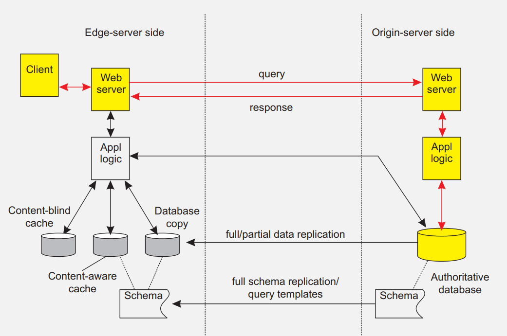
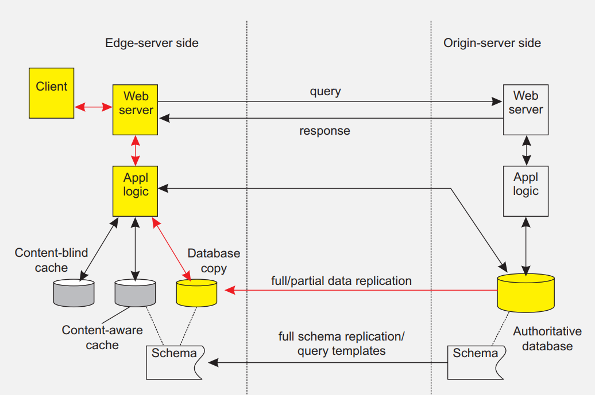

# Osztott rendszerek kidolgozás

# Bevezetés

## Definíció: Elosztott rendszer

Az elosztott rendszer önálló számítógépek olyan összessége, amely kezeloi számára egyetlen koherens rendszernek tűnik.

## Az elosztott rendszer célja

- Távoli eroforrások elérhetővé tétele
- Átlátszóság (distribution transparency)
- Nyitottság (openness)
- Skálázhatóság (scalability)

## Az átlátszóság mértéke

- A teljes átlátszóságra törekvés általában túl eros:

  - A felhasználók különbözo kontinenseken tartózkodhatnak
  - A hálózatok és az egyes gépek meghibásodásának teljes elfedése elméletileg és gyakorlatilag is lehetetlen

    - Nem lehet eldönteni, hogy a szerver csak lassan válaszol vagy meghibásodott
    - Távolról nem megállapítható, hogy a szerver feldolgozta-e a kérésünket, mielott összeomlott

  - A nagymértékű átlátszóság a hatékonyság rovására megy, de a késleltetést is el szeretnénk rejteni

    - Ilyen feladat lehet a webes gyorsítótárak (cache-ek) tökéletesen frissen tartása
    - Másik példa: minden változás azonnal lemezre írása nagymértékű hibatűréshez

## Elosztott rendszerek nyitottsága

### Nyitott elosztott rendszer

A rendszer képes más nyitott rendszerek számára szolgáltatásokat nyújtani, és azok szolgáltatásait igénybe venni:

- A rendszerek jól definiált interfészekkel rendelkeznek
- Az alkalmazások hordozhatóságát (portability) minél inkább támogatják
- Könnyen elérheto a rendszerek együttműködése (interoperability)

A nyitottság elérése

A nyitott elosztott rendszer legyen könnyen alkalmazható heterogén környezetben, azaz különböző

- hardvereken,
- platformokon,
- programozási nyelveken.

### A nyitottság implementálása

- Fontos, hogy a rendszer könnyen cserélheto részekből álljon
- Belso interfészek használata, nem egyetlen monolitikus rendszer
- A rendszernek minél jobban paraméterezhetonek kell lennie
- Egyetlen komponens megváltoztatása/cseréje lehetoleg minél kevésbé hasson a rendszer más részeire

### Átméretezhetoség

Ha egy „kis" rendszer megno, az sokfajta kihívást jelenthet. Több különböző jellege is megnohet a rendszernek:

- méret szerinti átméretezhetoség: több felhasználó és/vagy folyamat van a rendszerben
- földrajzi átméretezhetoség: a rendszert nagyobb területrol veszik igénybe, pl. egyetemen belüli felhasználás→világméretű felhasználóbázis
- adminisztrációs átméretezhetoség : biztonsági, karbantartási, együttműködési kérdések merülnek fel, ha új adminisztrációs tartományok kerülnek a rendszerbe

## Technikák az átméretezhetoség megvalósítására

### A kommunikációs késleltetés elfedése

A válaszra várás közben más tevékenység végzése:

- Aszinkron kommunikáció használata
- A beérkezo választ külön kezelő dolgozza fel
- Probléma: nem minden alkalmazás ültetheto át ilyen megközelítésre

### Elosztás

Az adatokat és a számításokat több számítógép tárolja/végzi:

- A számítások egy részét a kliensoldal végzi (Java appletek)
- Decentralizált elnevezési rendszerek (DNS)
- Decentralizált információs rendszerek (WWW)

### Replikáció/cache-elés

Több számítógép tárolja egy adat másolatait:

- Replikált fájlszerverek és adatbázisok
- Tükrözött weboldalak
- Weboldalak cache-elése (böngészokben, proxy szervereken)
- Fájlok cache-elése (a szerver- és kliensoldalon)

## Átméretezhetoség – a probléma

### Megjegyzés

Az átméretezhetoség könnyen elérhető, de ára van:

- Több másolat fenntartása (cache vagy replika) inkonzisztenciához vezet: ha módosítunk egy másolatot, az eltér a többitol.
- A másolatok konzisztensen tartásához globális szinkronizációra van szükség minden egyes változtatás után.
- A globális szinkronizáció viszont rosszul skálázható nagy rendszerekre.

## Következmény

Ha feladjuk a globális szinkronizációt, akkor kénytelenek vagyunk bizonyos fokú inkonzisztenciát elviselni a rendszerünkben. Az, hogy ez milyen mértékben elfogadható, rendszerfüggő.

## Elosztott rendszerek fejlesztése: hibalehetoségek

### Megjegyzés

Az elosztott rendszer környezetérol kényelmes lehet feltételezni, hogy megbízható. Ha ez tévesnek bizonyul, az a rendszer újratervezéséhez vezethet. Néhány ilyen feltételezés:

- a hálózat hibamentes
- a hálózat biztonságos
- a hálózat homogén
- a hálózati topológia nem változik
- a kommunikációnak nincsen idoigénye
- a sávszélesség korlátlan
- a kommunikációnak nincsen költsége
- csak egy adminisztrátor van

## Elosztott rendszerek fajtái

- Elosztott számítási rendszerek

  - grid
  - cluster
  - cloud

- Elosztott információs rendszerek
- Elosztott átható (pervasive, ubiquitous) rendszerek

## Elosztott számítási rendszerek

### Számítási rendszer

Sok elosztott rendszer célja számítások végzése nagy teljesítménnyel.

### Cluster (fürt)

Lokális hálózatra kapcsolt számítógépek összessége.

- Homogén: ugyanaz az operációs rendszer, hardveresen nem vagy csak alig térnek el
- A vezérlés központosítva van, általában egyetlen gépre

### Grid (rács)

Több gép, kevésbé egységesek:

- Heterogén architektúra
- Átívelhet több szervezeti egységen
- Nagyméretű hálózatokra terjedhet ki

### Felho (cloud)

Többrétegű architektúra.

#### Négy különbözo réteg:

- Hardver: Processzorok, útválasztók (routerek), áramforrások, hűtoberendezések. A felhasználók közvetlenül nem látják.
- Infrastruktúra: Virtuális hardvert tesz elérhetové: szerver, adattároló, hálózati kapcsolat, számítási kapacitás lefoglalása és kezelése.
- Platform: Magasabb szintű absztrakciókat biztosít. Pl. az Amazon S3 társzolgáltatás különbözo fájlműveleteket biztosít; a felhasználónak vödrei (bucket) vannak, ebbe feltölthet, letölthet stb. fájlokat egy API segítségével.
- Alkalmazás: A végfelhasználónak szánt, jellemzoen grafikus felületű alkalmazások.

## Elosztott információs rendszerek

### Definíció

Sok elosztott rendszer elsodleges célja adatok kezelése, illetve meglevo ilyen rendszerek elérése. Példa: tranzakciókezelo rendszerek

## Elosztott információs rendszerek: tranzakciók

Modell

A tranzakció adatok összességén (adatbázis, objektumok vagy más adattár) végzett művelet (lehetnek részműveletei), melynek az alábbi tulajdonságai vannak. A kezdobetűk rövidítéséből ACID-nek szokás nevezni a követelményrendszert

- Atomicity (atomosság): Vagy a tranzakció minden eleme sikerrel végrehajtódik, vagy egyik sem.
- Consistency (konzisztencia): A tranzakció végével konzisztens állapot kell, hogy fent álljon. (közben elofordulhat inkonzisztencia)
- Isolation (elkülöníthetoség): Minden tranzakciónak úgy kell végbemennie, mintha az lenne az egyetlen aktív tranzakció, vagyis elkülöníthetoek legyenek egymástól és ne befolyásolják egymást semmilyen módon.
- Durability (tartósság): A tranzakció által végrehajtott módosításokat tartós adattárolóra kell írni, hogy esetleges rendszerhiba esetén visszaállíthatóak legyenek.

### Tranzakciófeldolgozó monitor

A tranzakciókat sokszor több szerver hajtja végre. Ezeket egy TP monitor vezérli.

## Alkalmazásintegráció nagy rendszerekben

A TP monitor nem választja el az alkalmazásokat az adatbázisoktól. Továbbá az alkalmazásoknak egymással is kommunikálniuk kell.

- Távoli eljáráshívás (Remote Procedure Call, RPC)
- Üzenetorientált köztesréteg (Message-Oriented Middleware, MOM)

## Elosztott átható rendszerek

Sok modern elosztott rendszer kicsi, mobil elemekbol áll.

### Néhány jellemző

- A környezet megváltozhat: A rendszernek ezt követnie kell.
- Ad hoc szervezodés: A rendszer komponenseit nagyon különböző módokon használhatják a felhasználók. Ezért a rendszernek könnyen konfigurálhatónak kell lennie.
- Megosztott szolgáltatások: Mivel a rendszer nagyon változékony, az adatoknak könnyen kell áramlaniuk. Ennek elosegítésére a rendszer elemei általában nagyon egyszerű szerkezetűek.

## Érzékelohálózatok

Az érzékeloket tartalmazó csúcsok

- sok van belolük (nagyságrendileg 10-1000 darab)
- egyszerűek (kevés memória, számítási és kommunikációs kapacitás)
- sokszor elemrol működnek, vagy áramforrás sem szükséges hozzájuk

# Architektúrák

- Architektúrafajták
- Szoftverarchitektúrák
- Architektúrák és köztesréteg
- Az elosztott rendszerek önszervezése

## Architektúrafajták

A rendszer elemeit szervezzük logikai szerepük szerint különböző komponensekbe, és ezeket osszuk el a rendszer gépein.

(a) A többrétegű megközelítés kliens-szerver rendszerek esetén jól működik

(b) Itt a komponensek (objektumok) összetettebb struktúrában kommunikálnak, mindegyik közvetlenül küld üzeneteket a többieknek

A komponensek közötti kommunikáció történhet közvetlen kapcsolat nélkül („anonim"), illetve egyidejűség nélkül („aszinkron").

(a) Publish/subscribe modell (térben független)

(b) Megosztott, perzisztens adattár (térben és idoben független)

## Központosított architektúrák

### Egyszerű kliens–szerver modell

Jellemzoi: egyes folyamatok szolgáltatásokat ajánlanak ki (ezek a szerverek) más folyamatok ezeket a szolgáltatásokat szeretnék használni (ezek a kliensek) a kliensek és a szerverek különbözo gépeken lehetnek a kliens kérést küld (amire a szerver válaszol), így veszi igénybe a szolgáltatást

## Többrétegű architektúrák

### Elosztott információs rendszerek rétegelése

Az elosztott információs rendszerek gyakran három logikai rétegre („layer" vagy „tier") vannak tagolva.

### Háromrétegű architektúra

- Megjelenítés (user interface): az alkalmazás felhasználói felületét alkotó komponensekbol áll
- Üzleti logika (application): az alkalmazás működését írja le (konkrét adatok nélkül)
- Perzisztencia (data layer): az adatok tartós tárolása

A három rétegbol néha több is egy gépen található meg. Kétrétegű architektúra: kliens/egyszerű szerver Egyrétegű architektúra: nagygépre (mainframe) kötött terminal

## Decentralizált architektúrák

### Peer-to-peer architektúra

Az utóbbi években a peer-to-peer (P2P) architektúra egyre népszerűbbé válik. A „peer" szó arra utal, hogy a csúcsok között (többnyire) nincsenek kitüntetett szerepűek.

- strukturált P2P: a csúcsok által kiadott gráfszerkezet rögzített
- strukturálatlan P2P: a csúcsok szomszédai véletlenszerűek
- hibrid P2P: néhány csúcsnak speciális szerepe van, ezek a többitol eltérő szervezésűek

### Overlay hálózat

overlay: A gráfban szomszédos csúcsok a fizikai hálózaton lehetnek távol egymástól, a rendszer elfedi, hogy a köztük levo kommunikáció több gépet érintve történik.

- A legtöbb P2P rendszer overlay hálózatra épül

## Strukturált P2P rendszerek

A csúcsokat valamilyen struktúra szerint overlay hálózatba szervezzük (pl. logikai gyűrű), és a csúcsoktól az azonosítójuk alapján lehet szolgáltatásokat igénybe venni.

### Példa: d dimenziós particionált tér

Az adatoknak most d mezoje van, kulccsal nem rendelkeznek. Az így adódó tér fel van osztva annyi tartományra, ahány csúcsunk van; minden csúcs valamelyik tartomány adataiért felelos. Ha egy új csúcs érkezik, kettébontunk egy tartományt.

### Strukturálatlan P2P rendszer

A strukturálatlan P2P rendszerek igyekeznek véletlen gráfstruktúrát fenntartani.

- Mindegyik csúcsnak csak részleges nézete van a gráfról (a teljes hálózatnak csak egy kis részét látja).
- Minden P csúcs idoközönként kiválaszt egy szomszédos Q csúcsot
- P és Q információt cserél, valamint átküldik egymásnak az általuk ismert csúcsokat

## Overlay hálózatok topológiájának kezelése

Különböztessünk meg két réteget: (1) az alsó rétegben a csúcsoknak csak részleges nézete van; (2) a felso rétegbe csak kevés csúcs kerülhet. Az alsó réteg véletlenszerű csúcsokat ad át a felso rétegnek; a felső réteg ezek közül csak keveset tart meg.

### Tórusz overlay topológia kialakítása

Ha megfeleloen választjuk meg, milyen csúcsokat tartson meg a felső réteg, akkor a kezdetben véletlenszerű overlay kapcsolatok hamarosan szabályos alakba rendezodnek. Itt egy távolságfüggvény szerinti megtartó szabály hat (az overlay a közelieket veszi át), és már az elso néhány lépés után jól látszik a kijövő tórusz-alakzat.

## Overlay topológia: példa: clusterezés

Most mindegyik i csúcshoz hozzárendelünk egy GID(i) ∈ N számot, és azt mondjuk, hogy i a GID(i) csoportba tartozik.

Szintén távolságfüggvényt használunk:

dist(i,j) = 1 ha GID(i) = GID(j)

0 ha GID(i) 6= GID(j)

Itt is igen gyorsan kialakul a kívánt szerkezet: csak az azonos csoportbeli csúcsok között lesz kapcsolat, kialakulnak a clusterek.

## Superpeer csúcsok

superpeer: olyan kisszámú csúcs, amelyeknek külön feladata van

## Hibrid arch.: kliens-szerver + P2P: edge szerver

edge szerver: az adatokat tároló szerver, a kliensekhez minél közelebb van elhelyezve, jellemzoen ott, ahol egy nagyobb hálózat az Internetre csatlakozik Content Delivery Network (CDN) rendszerekben jellemzo, a tartalomszolgáltatás hatékonyságát növelik és költségét csökkentik.

## Hibrid arch.: kliens-szerver + P2P: BitTorrent

Miután a csúcs kiderítette, melyik másik csúcsok tartalmaznak részeket a kívánt fájlból, azokat párhuzamosan tölti le, és egyúttal önmaga is kiajánlja megosztásra.

## Architektúrák és köztesréteg

Elofordulhat, hogy az elosztott rendszer/alkalmazás szerkezete nem felel meg a megváltozott igényeknek. Ilyenkor legtöbbször nem kell újraírni a teljes rendszert: elegendo lehet (dinamikusan) adaptálni a köztesréteg viselkedését.

### Interceptor

interceptor: Távoli objektum elérése során a vezérlés szokásos menetébe avatkozik bele, pl. átalakíthatja más formátumra a kérést. Jellemzoen az architektúra rétegei közé illeszthető.

## Adaptív middleware

- Funkciók szétválasztása (separation of concerns): A szoftver különbözo jellegű funkciói váljanak minél jobban külön, így azokat könnyebb egymástól függetlenül módosítani.
- Önvizsgálat (reflection): A program legyen képes feltárni a saját szerkezetét, és futás közben módosítani azt.
- Komponensalapú szervezés: Az elosztott alkalmazás legyen moduláris, a komponensei legyenek könnyen cserélhetoek. A komponensek közötti függések legyenek egyértelműek, és csak annyi legyen belolük, amennyi feltétlenül szükséges

## Önszervezo elosztott rendszerek

### Adaptív rendszer képességei

Az egyes szoftverelemek adaptivitása kihat a rendszerre, ezért megvizsgáljuk, hogyan lehet adaptív rendszereket készíteni. Különféle elvárásaink lehetnek:

- Önkonfiguráció
- Önkezelo
- Öngyógyító
- Önoptimalizáló
- Ön*

## Adaptivitás visszacsatolással

### Visszacsatolásos modell

Az ön* rendszerek sokszor az alábbi jellegű visszacsatolásos vezérléssel rendelkeznek: mérik, hogy a rendszer mennyire tér el a kívánt tulajdonságoktól, és szükség szerint változtatnak a beállításokon.

## Globule

- Kollaboratív webes CDN, a tartalmakat költségmodell alapján helyezi el (minden szempontra: fontosság×költség).
- A központi szerver (origin server) elemzi, ami történt, és az alapján állítja be a fontossági paramétereket, hogy mi történt volna, ha P oldalt az S edge szerver tárolta volna.
- A számításokat különbözo stratégiákra végzi el, végül a legjobbat választja ki.

## Szálak: bevezetés

A legtöbb hardvereszköznek létezik szoftveres megfeleloje.

Processzor (CPU): Hardvereszköz, utasításokat képes sorban végrehajtani, amelyek egy megadott utasításkészletbol származnak.

Szál (thread): A processzor egyfajta szoftveres megfeleloje, minimális kontextussal (környezettel). Ha a szálat megállítjuk, a kontextus elmentheto és továbbfuttatáshoz visszatölthető.

Folyamat (process, task): Egy vagy több szálat összefogó nagyobb egység. Egy folyamat szálai közös memóriaterületen (címtartományon) dolgoznak, azonban különbözo folyamatok nem látják egymás memóriaterületét.

## Kontextusváltás

- kontextusváltás: A másik folyamatnak/szálnak történő vezérlésátadás, illetve a megfelelo kontextusok cseréje. Így egy processzor több folyamatot/szálat is végre tud hajtani.

- Processzor kontextusa: Az utasítások végrehajtásában szerepet játszó kisszámú regiszter (elemi értéktároló) tartalma.

- Szál kontextusa: Jellemzoen nem sokkal bővebb a processzorkontextusnál. A szálak közötti váltáshoz nem kell igénybe venni az operációs rendszer szolgáltatásait.

- Folyamat kontextusa: Ahhoz, hogy a régi és az új folyamat memóriaterülete elkülönüljön, a memóriavezérlo (memory management unit, MMU) tartalmának jórészét át kell írni, amire csak a kernel szintnek van joga. A folyamatok létrehozása, törlése és a kontextusváltás köztük sokkal költségesebb a szálakénál.

## Szálak és operációs rendszerek

### Hol legyenek a szálak?

A szálakat kezelheti az operációs rendszer, vagy tole független szálkönyvtárak. Mindkét megközelítésnek vannak elonyei és hátrányai.

### Szálak folyamaton belül: szálkönyvtárak

- elony : Minden műveletet egyetlen folyamaton belül kezelünk, ez hatékony.
- hátrány: Az operációs rendszer számára a szál minden művelete a gazdafolyamattól érkezik ⇒ ha a kernel blokkolja a szálat (pl. lemezművelet során), a folyamat is blokkolódik.
- hátrány: Ha a kernel nem látja a szálakat közvetlenül, hogyan tud szignálokat közvetíteni nekik?

## Szálak és operációs rendszerek

### Szálak folyamaton kívül: kernelszintű szálak

A szálkönyvtárak helyezhetoek kernelszintre is. Ekkor minden szálművelet rendszerhíváson keresztül érheto el.

- elony : A szálak blokkolása nem okoz problémát: a kernel be tudja ütemezni a gazdafolyamat egy másik szálát.
- elony : A szignálokat a kernel a megfelelo szálhoz tudja irányítani.
- hátrány: Mivel minden művelet a kernelt érinti, ez a hatékonyság rovására megy.

## Solaris szálak

### Könnyűsúlyú folyamatok

könnyűsúlyú folyamat (lightweight process, LWP): Kernelszintű szálak, amelyek felhasználói szintű szálkezeloket futtatnak.

## Szálak a kliensoldalon

### Többszálú webkliens

A hálózat késleltetésének elfedése:

- A böngészo letöltött egy oldalt, ami több másik tartalomra hivatkozik.
- Mindegyik tartalmat külön szálon tölti le, amíg a HTTP kéréseket kiszolgálják, ezek blokkolódnak.
- Amikor egy-egy fájl megérkezik, a blokkolás megszűnik, és a böngésző megjeleníti a tartalmat.

### Több távoli eljáráshívás (RPC) egyszerre

- Egy kliens több távoli szolgáltatást szeretne igénybe venni. Mindegyik kérést külön szál kezeli.
- Megvárja, amíg mindegyik kérésre megérkezik a válasz.
- Ha különbözo gépekre irányulnak a kérések, akár lineáris mértékű gyorsulás is elérheto így

## Szálak a szerveroldalon

### Cél: a hatékonyság növelése

- Szálakat sokkal olcsóbb elindítani, mint folyamatokat (ido- és tárigény szempontjából egyaránt).
- Mivel egy processzor csak egy szálat tud végrehajtani, a többprocesszoros rendszerek kapacitását csak többszálú szerverek képesek kihasználni.
- A kliensekhez hasonlóan, a hálózat késleltetését lehet elfedni azzal, ha egyszerre több kérést dolgoz fel a szerver.

### Cél: a program szerkezetének javítása

- A program jobban kezelheto lehet, ha sok egyszerű, blokkoló hívást alkalmaz, mint más szerkezet esetén. Ez némi teljesítményveszteséggel járhat.
- A többszálú programok sokszor kisebbek és könnyebben érthetoek , mert jobban átlátható, merre halad a vezérlés.

## Virtualizáció

A virtualizáció szerepe egyre no több okból.

- A hardver gyorsabban fejlodik a szoftvernél
- Növeli a kód hordozhatóságát és költöztethetoségét
- A hibás vagy megtámadott rendszereket könnyű így elkülöníteni

## A virtuális gépek szerkezete

### Virtualizálható komponensek

A rendszereknek sokfajta olyan rétege van, amely mentén virtualizálni lehet a komponenseket. Mindig eldöntendo, milyen interfészeket kell szolgáltatnia a virtuális gépnek (és milyeneket vehet igénybe).

## Process VM, VM monitor

- Process VM: A virtuális gép (virtual machine, VM) közönséges programként fut, bájtkódot (elofordított programkódot) hajt végre. Pl. JVM, CLR, de vannak speciális célúak is, pl. ScummVM.
- VM Monitor (VMM), hypervisor: Hardver teljeskörű virtualizációja, bármilyen program és operációs rendszer futtatására képes. Pl. VMware, VirtualBox.

## VM monitorok működése

Sok esetben a VMM egy operációs rendszeren belül fut.

- A VMM a futtatott gépi kódú utasításokat átalakítja a gazdagép utasításaivá, és azokat hajtja végre.
- A rendszerhívásokat és egyéb privilegizált utasításokat, amelyek végrehajtásához az operációs rendszer közreműködésére lenne szükség, megkülönböztetett módon kezeli.

## Kliens: átlátszóság

### A kliensekkel kapcsolatos fobb átlátszóságok

- hozzáférési: az RPC kliensoldali csonkja
- elhelyezési/áthelyezési: a kliensoldali szoftver tartja számon, hol helyezkedik el az eroforrás
- többszörözési: a klienscsonk kezeli a többszörözött hívásokat
- meghibásodási: sokszor csak a klienshez helyezheto – csak ott jelezhető a kommunikációs probléma

## Szerver: általános szerkezet

szerver: Olyan folyamat, amely egy (vagy akár több) porton várja a kliensek kéréseit. Egy adott porton (ami egy 0 és 65535 közötti szám) a szerver egyfajta szolgáltatást nyújt. A 0-1023 portok közismert szolgáltatásokat nyújtanak, ezeket Unix alapú rendszereken csak rendszergazdai jogosultsággal lehet foglalni.

### Szerverfajták

- szuperszerver : Olyan szerver, amelyik több porton figyeli a bejövő kapcsolatokat, és amikor új kérés érkezik, új folyamatot/szálat indít annak kezelésére. Pl. Unix rendszerekben: inetd.
- iteratív↔konkurens szerver : Az iteratív szerverek egyszerre csak egy kapcsolatot tudnak kezelni, a konkurensek párhuzamosan többet is.

## Szerver: sávon kívüli kommunikáció

### Sürgos üzenetek küldése

Meg lehet-e szakítani egy szerver működését kiszolgálás közben?

### Külön port

A szerver két portot használ, az egyik a sürgos üzeneteknek van fenntartva:

- Ezt külön szál/folyamat kezeli
- Amikor fontos üzenet érkezik, a normál üzenet fogadása szünetel
- A szálnak/folyamatnak nagyobb prioritást kell kapnia, ehhez az oprendszer támogatása szükséges

### Sávon kívüli kommunikáció

Sávon kívüli kommunikáció használata, ha rendelkezésre áll:

- Pl. a TCP protokoll az eredeti kérés kapcsolatán keresztül képes sürgos üzenetek továbbítására
- Szignálok formájában kapható el a szerveren belül

## Szerver: állapot

### Állapot nélküli szerver

Nem tart fenn információkat a kliensrol a kapcsolat bontása után.

- Nem tartja számon, melyik kliens milyen fájlból kért adatokat
- Nem ígéri meg, hogy frissen tartja a kliens gyorsítótárát
- Nem tartja számon a bejelentkezett klienseket: nincsen munkamenet (session)

#### Következmények

- A kliensek és a szerverek teljesen függetlenek egymástól
- Kevésbé valószínű, hogy inkonzisztencia lép fel azért, mert valamelyik oldal összeomlik
- A hatékonyság rovására mehet, hogy a szerver nem tud semmit a kliensrol, pl. nem tudja előre betölteni azokat az adatokat, amelyekre a kliensnek szüksége lehet

### Állapotteljes szerverek

Állapotot tart számon a kliensekrol:

- Megjegyzi, melyik fájlokat használta a kliens, és ezeket elore meg tudja nyitni legközelebb
- Megjegyzi, milyen adatokat töltött le a kliens, és frissítéseket küldhet neki

#### Elonyök és hátrányok

Az állapotteljes szerverek nagyon hatékonyak tudnak lenni, ha a kliensek lokálisan tárolhatnak adatokat. Az állapotteljes rendszereket megfeleloen megbízhatóvá is lehet tenni a hatékonyság jelentos rontása nélkül.

## Szerver: háromrétegű clusterek

## A kérések kezelése

### Szűk keresztmetszet

Ha minden kapcsolatot végig az elso réteg kezel, könnyen szűk keresztmetszetté válhat.

A terhelés csökkentheto, ha a kapcsolatot átadjuk ( TCP handoff).

## Elosztott rendszerek: mobil IPv6

### Essence

A mobil IPv6-ot támogató kliensek az elosztott szolgáltatás bármelyik peer-jéhez kapcsolódhatnak.

- A C kliens kapcsolódik a szerver otthonának (home address, HA) IPv6 címéhez
- A HA címen a szerver hazai ügynöke (home agent) fogadja a kérést, és a megfelelő felügyeleti címre (care-of address, CA) továbbítja
- Ezután C és CA már közvetlenül tudnak kommunikálni (HA érintése nélkül)

### kollaboratív CDN-ek

Az origin server tölti be HA szerepét, és átadja a beérkezo kapcsolatot a megfelelo peer szervernek. A kliensek számára az origin és a peer egy szervernek látszik.

## Kódmigráció: jellemzo feladatok

kódmigráció: olyan kommunikáció, amely során nem csak adatokat küldünk át

Néhány jellemzo feladat, amelyhez kódmigrációra van szükség.

- Client-Server: a szokásos kliens-szerver kommunikáció, nincsen kódmigráció
- Remote Evaluation: a kliens feltölti a kódot, és a szerveren futtatja
- Code on Demand: a kliens letölti a kódot a szerverrol, és helyben futtatja
- Mobile Agent: a mobil ágens feltölti a kódját és az állapotát, és a szerveren folytatja a futását

## Kódmigráció: gyenge és eros mobilitás

### Objektumkomponensek

- Kódszegmens: a programkódot tartalmazza
- Adatszegmens: a futó program állapotát tartalmazza
- Végrehajtási szegmens: a futtató szál környezetét tartalmazza

### Gyenge mobilitás

A kód- és adatszegmens mozgatása (a kód újraindul):

- Viszonylag egyszerű megtenni, különösen, ha a kód hordozható
- Irány szerint: feltöltés (push, ship), letöltés (pull, fetch)

### Eros mobilitás

A komponens a végrehajtási szegmenssel együtt költözik

- Migráció: az objektum átköltözik az egyik géprol a másikra
- Klónozás: a kód másolata kerül a másik gépre, és ugyanabból az állapotból indul el, mint az eredeti; az eredeti is fut tovább

## Kódmigráció: az eroforrások elérése

Az eredeti gépen található eroforrások költözés után a kód számára távoliakká válnak.

### Eroforrás–gép kötés erőssége

- Mozdíthatatlan: nem költöztetheto (pl. fizikai hardver)
- Rögzített: költöztetheto, de csak drágán (pl. nagy adatbázis)
- Csatolatlan: egyszerűen költöztetheto (pl. gyorsítótár)

### Komponens–eroforrás kötés jellege

Milyen jellegű eroforrásra van szüksége a komponensnek?

- Azonosítókapcsolt: egy konkrét (pl. a cég adatbázisa)
- Tartalomkapcsolt: adott tartalmú (pl. bizonyos elemeket tartalmazó cache)
- Típuskapcsolt: adott jellegű (pl. színes nyomtató)

## Kódmigráció: az eroforrások elérése

### Kapcsolat az eroforrással

Hogyan tud a komponens kapcsolatban maradni az eroforrással?

- Típuskapcsolt eroforrás esetén a legkönnyebb újrakapcsolódni egy lokális, megfelelo típusú erőforráshoz
- Azonosítókapcsolt vagy tartalomkapcsolt esetben:

  - rendszerszintű hivatkozást létesíthetünk az eredeti eroforrásra ,

    - mozdíthatatlan eroforrások esetén ez az egyetlen lehetőség
    - minden más esetben is szóba jöhet, de általában van jobb megoldás

  - azonosítókapcsolt eroforrást érdemes áthelyezni
  - tartalomkapcsolt eroforrást érdemes lemásolni

## Kódmigráció: heterogén rendszerben

### Nehézségek

- A célgép nem biztos, hogy képes futtatni a migrált kódot
- A processzor-, szál- és/vagy folyamatkörnyezet nagyban függ a lokális hardvertol, oprendszertől és futtatókörnyezettől

### Megoldás problémás esetekben

Virtuális gép használata: akár process VM, akár hypervisor. Természetesen a virtuális gépnek elérhetonek kell lennie mindkét környezetben.

# Kommunikacio

## Az ISO/OSI hálózatkezelési modell

### Hátrányok

- Csak az üzenetküldésre koncentrál
- Az (5) és (6) rétegek legtöbbször nem jelennek meg ilyen tisztán
- Az elérési átlátszóság nem teljesül ebben a modellben

## Az alsó rétegek

### A rétegek feladatai

- Fizikai réteg: a bitek átvitelének fizikai részleteit írja le
- Adatkapcsolati réteg: az üzeneteket keretekre tagolja, célja a hibajavítás és a hálózat terhelésének korlátozása
- Hálózati réteg: a hálózat távoli gépei között közvetít csomagokat útválasztás (routing) segítségével

## Szállítási réteg

### Absztrakciós alap

A legtöbb elosztott rendszer a szállítási réteg szolgáltatásaira épít.

### A legfobb protokollok

- TCP: kapcsolatalapú, megbízható, sorrendhelyes átvitel
- UDP: nem (teljesen) megbízható, általában kis üzenetek (datagram) átvitele

## Csoportcímzés

IP-alapú többcímű üzenetküldés (multicasting) sokszor elérheto, de legfeljebb a lokális hálózaton belül használatos.

## Köztesréteg

### Szolgáltatásai

A köztesrétegbe (middleware) olyan szolgáltatásokat és protokollokat szokás sorolni, amelyek sokfajta alkalmazáshoz lehetnek hasznosak.

- Sokfajta kommunikációs protokoll
- Sorosítás ((de)serialization, (un)marshalling), adatok reprezentációjának átalakítása (elküldésre vagy elmentésre)
- Elnevezési protokollok az eroforrások megosztásának megkönnyítésére
- Biztonsági protokollok a kommunikáció biztonságossá tételére
- Skálázási mechanizmusok adatok replikációjára és gyorsítótárazására

### Alkalmazási réteg

Az alkalmazások készítoinek csak az alkalmazás-specifikus protokollokat kell önmaguknak implementálniuk.

## A kommunikáció fajtái

- idoleges (transient) vagy megtartó (persistent)
- aszinkron vagy szinkron

### Idoleges vs megtartó

- Megtartó kommunikáció: A kommunikációs rendszer hajlandó huzamosan tárolni az üzenetet.
- Idoleges kommunikáció: A kommunikációs rendszer elveti az üzenetet, ha az nem kézbesítheto.

### A szinkronizáció lehetséges helyei

- Az üzenet elindításakor
- Az üzenet beérkezésekor
- A kérés feldolgozása után

## Kliens–szerver modell

### Általános jellemzok

A kliens–szerver modell jellemzoen idoleges, szinkron kommunikációt használ.

- A kliensnek és a szervernek egyidoben kell aktívnak lennie.
- A kliens blokkolódik, amíg a válasz meg nem érkezik.
- A szerver csak a kliensek fogadásával foglalkozik, és a kérések kiszolgálásával.

### A szinkron kommunikáció hátrányai

- A kliens nem tud tovább dolgozni, amíg a válasz meg nem érkezik
- A hibákat rögtön kezelni kell, különben feltartjuk a klienst
- Bizonyos feladatokhoz (pl. levelezés) nem jól illeszkedik

## Üzenetküldés

### Üzenetorientált köztesréteg (message-oriented middleware, MOM)

Megtartó, aszinkron kommunikációs architektúra.

- Segítségével a folyamatok üzeneteket küldhetnek egymásnak
- A küldo félnek nem kell válaszra várakoznia, foglalkozhat mással
- A köztesréteg gyakran hibatűrést biztosít

## RPC: alapok

### Az RPC alapötlete

- Az alprogramok használata természetes a fejlesztés során
- Az alprogramok a jó esetben egymástól függetlenül működnek („fekete doboz"),
- ... így akár egy távoli gépen is végrehajthatóak

## RPC: Hivas lepesei

## RPC: paraméterátadás

### A paraméterek sorosítása

A második lépésben a klienscsonk elkészíti az üzenetet, ami az egyszerű bemásolásnál összetettebb lehet.

- A kliens- és a szervergépen eltérhet az adatábrázolás (eltérő bájtsorrend)
- A sorosítás során bájtsorozat készül az értékbol
- Rögzíteni kell a paraméterek kódolását:

  - A primitív típusok reprezentációját (egész, tört, karakteres)
  - Az összetett típusok reprezentációját (tömbök, egyéb adatszerkezetek)

- A két csonknak fordítania kell a közös formátumról a gépeik formátumára

### RPC paraméterátadás szemantikája

- Érték–eredmény szerinti paraméterátadási szemantika: pl. figyelembe kell venni, hogy ha (a kliensoldalon ugyanoda mutató) hivatkozásokat adunk át, azokról ez a hívott eljárásban nem látszik.
- Minden feldolgozandó adat paraméterként kerül az eljáráshoz; nincsen globális hivatkozás. ###Átlátszóság Nem értheto el teljes mértékű elérési átlátszóság.

### Távoli hivatkozás

Távoli hivatkozás bevezetésével növelheto az elérési átlátszóságot:

- A távoli adat egységesen érheto el
- A távoli hivatkozásokat át lehet paraméterként adni

## Aszinkron RPC

### Az RPC „javítása"

A szerver nyugtázza az üzenet megérkezését. Választ nem vár

## Késleltetett szinkronizált RPC

### Késleltetett szinkronizált RPC

Ez két aszinkron RPC, egymással összehangolva.

## További lehetoség

A kliens elküldheti a kérését, majd idonként lekérdezheti a szervertől, kész-e már a válasz.

## RPC: a kliens csatlakozása a szerverhez

### A kliens

- A szolgáltatások katalógusba jegyzik be (globálisan és lokálisan is), melyik gépen érhetoek el. (1-2)
- A kliens kikeresi a szolgáltatást a katalógusból. (3)
- A kliens végpontot igényel a démontól a kommunikációhoz. (4)

## Üzenetorientált köztesréteg

### Működési elv

A köztesréteg várakozási sorokat (queue) tart fenn a rendszer gépein. A kliensek az alábbi műveleteket használhatják a várakozási sorokra.

## Üzenetközvetítő

### Üzenetsorkezelo rendszer homogenitása

Az üzenetsorkezelo rendszerek feltételezik, hogy a rendszer minden eleme közös protokollt használ, azaz az üzenetek szerkezete és adatábrázolása megegyezo.

### Üzenetközvetítő

üzenetközvetíto (message broker) : Olyan központi komponens, amely heterogén rendszerben gondoskodik a megfelelo konverziókról.

- Átalakítja az üzeneteket a fogadó formátumára.
- Szerepe szerint igen gyakran átjáró (application-level gateway, proxy) is, azaz a közvetítés mellet további (pl. biztonsági) funkciókat is nyújt
- Az üzenetek tartalmát is megvizsgálhatják az útválasztáshoz (subject based vagy object based routing) ⇒ Enterprise Application Integration

## WebSphere MQ (IBM)

- Az üzenetkezelok neve itt sorkezelő (queue manager); adott alkalmazásoknak címzett üzeneteket fogadnak

  - Az üzenetkezelot össze lehet szerkeszteni a kliensprogrammal
  - Az üzenetkezelo RPC-n keresztül is elérhető

- Az útválasztótáblák (routing table) megadják, melyik kimenő csatornán kell továbbítani az üzenetet
- A csatornákat üzenetcsatorna-ügynökök (message channel agent, MCA) kezelik

  - Kiépítik a hálózati kapcsolatokat (pl. TCP/IP)
  - Ki- és becsomagolják az üzeneteket, és fogadják/küldik a csomagokat a hálózatról

## Folyamatos média

### Az ido szerepe

Az eddig tárgyalt kommunikációfajtákban közös, hogy diszkrét ábrázolásúak: az adategységek közötti idobeli kapcsolat nem befolyásolja azok jelentését.

### Folyamatos ábrázolású média

A fentiekkel szemben itt a továbbított adatok idofüggőek . Néhány jellemzo példa:

- audio
- videó
- animációk
- szenzorok adatai (homérséklet, nyomás stb.)

### Adatátviteli módok

Többfajta megkötést tehetünk a kommunikáció idobeliségével kapcsolatban.

- aszinkron: nem ad megkötést arra, hogy mikor kell átvinni az adatot
- szinkron: az egyes adatcsomagoknak megadott idotartam alatt célba kell érniük
- izokron vagy izoszinkrona : felso és alsó korlátot is ad a csomagok átvitelére; a remegés (jitter) így korlátozott mértékű

## Folyam

### Adatfolyam

adatfolyam: Izokron adatátvitelt támogató kommunikációs forma.

### Fontosabb jellemzok

- Egyirányú
- Legtöbbször egy forrástól (source) folyik egy vagy több nyelő (sink) felé
- A forrás és/vagy a nyelo gyakran közvetlenül kapcsolódik hardverelemekhez (pl. kamera, képernyo)
- egyszerű folyam: egyfajta adatot továbbít, pl. egy audiocsatornát vagy csak videót
- összetett folyam: többfajta adatot továbbít, pl. sztereo audiót vagy hangot+videót

### Szolgáltatás minosége

A folyamokkal kapcsolatban sokfajta követelmény írható elo, ezeket összefoglaló néven a szolgáltatás minoségének (Quality of Service, QoS) nevezzük. Ilyen jellemzok a következők:

- A folyam átvitelének „sebessége": bit rate.
- A folyam megindításának legnagyobb megengedett késleltetése.
- A folyam adategységeinek megadott ido alatt el kell jutniuk a forrástól a nyeloig ( end-to-end delay), illetve számíthat az oda-vissza út is (round trip delay).
- Az adategységek beérkezési idoközeinek egyenetlensége: remegés (jitter).

## Folyam: QoS biztosítása

### Differenciált szolgáltatási architektúra

Több hálózati eszköz érheto el, amelyekkel a QoS biztosítható. Egy lehetoség, ha a hálózat routerei kategorizálják az áthaladó forgalmat a beérkezo adatcsomagok tartalma szerint, és egyes csomagfajtákat elsobbséggel továbbítanak ( differentiated services).

### A remegés csökkentése

A routerek pufferelhetik az adatokat a remegés csökkentésére.

## Összetett folyam szinkronizációja

### Szinkronizáció a nyelonél

Az összetett folyam alfolyamait szinkronizálni kell a nyelonél, különben idoben elcsúszhatnának egymáshoz képest.

### Multiplexálás

Másik lehetoség: a forrás már eleve egyetlen folyamot készít (multiplexálás). Ezek garantáltan szinkronban vannak egymással, a nyelonél csak szét kellőket bontani ( demultiplexálás).

## Alkalmazásszintű multicasting

A hálózat minden csúcsának szeretnénk üzenetet tudjunk küldeni (multicast). Ehhez hierarchikus overlay hálózatba szervezzük oket.

### Chord struktúrában tárolt fa készítése

- A multicast hálózatunkhoz generálunk egy azonosítót, így egyszerre több multicast hálózatunk is lehet egy rendszerben.
- Tegyük fel, hogy az azonosító egyértelműen kijelöl egy csúcsot a rendszerünkbena . Ez a csúcs lesz a fa gyökere.
- Terv: a küldendo üzeneteket mindenki elküldi a gyökérhez, majd onnan a fán lefele terjednek.
- Ha a P csúcs csatlakozni szeretne a multicast hálózathoz, csatlakozási kérést küld a gyökér felé. A P csúcstól a gyökérig egyértelmű az útvonalb ; ennek minden csúcsát a fa részévé teszünk (ha még nem volt az). Így P elérhetové válik a gyökértől.

## Alkalmazásszintű multicasting: költségek

- Kapcsolatok terhelése: Mivel overlay hálózatot alkalmazunk, elofordulhat, hogy egy üzenetküldés többször is igénybe veszi ugyanazt a fizikai kapcsolatot. Példa: az A → D üzenetküldés kétszer halad át az Ra → Rb élen.
- Stretch: Az overlayt követo és az alacsonyszintű üzenetküldés költségének hányadosa. Példa: B → C overlay költsége 71, hálózati 47 ⇒ stretch = 71/47.

## Járványalapú algoritmusok

### Alapötlet

- Valamelyik szerveren frissítési műveletet (update) hajtottak végre, azt szeretnénk, hogy ez elterjedjen a rendszerben minden szerverhez.
- Minden szerver elküldi a változást néhány szomszédjának (messze nem az összes csúcsnak) lusta módon (nem azonnal)
- Tegyük fel, hogy nincs olvasás-írás konfliktus a rendszerben.

### Két alkategória

- Anti-entrópia: Minden szerver rendszeresen kiválaszt egy másikat, és kicserélik egymás között a változásokat.
- Pletykálás (gossiping): Az újonnan frissült (megfertozött ) szerver elküldi a frissítést néhány szomszédjának (megfertoziőket).

## Járvány: anti-entrópia

### A frissítések cseréje

- P csúcs Q csúcsot választotta ki.
- Küldés (push): P elküldi a nála levo frissítéseket Q-nak
- Rendelés (pull): P bekéri a Q-nál levo frissítéseket
- Küldés–rendelés (push–pull): P és Q kicserélik az adataikat, így ugyanaz lesz mindketto tartalma.

### Hatékonyság

A küldo–rendelő megközelítés esetébenő(log(N)) nagyságrendű forduló megtétele után az összes csúcshoz eljut a frissítés. Egy fordulónak az számít, ha mindegyik csúcs megtett egy lépést.

## Járvány: pletykálás

### Működési elv

Ha az S szerver új frissítést észlelt, akkor felveszi a kapcsolatot más szerverekkel, és elküldi számukra a frissítést. Ha olyan szerverhez kapcsolódik, ahol már jelen van a frissítés, akkor 1/k valószínűséggel abbahagyja a frissítés terjesztését.

### Hatékonyság

Kelloen sok szerver esetén a tudatlanságban maradó szerverek (akikhez nem jut el a frissítés) száma exponenciálisan csökken a k valószínűség növekedésével, de ezzel az algoritmussal nem garantálható, hogy minden szerverhez eljut a frissítés.

## Járvány: értékek törlése

### A törlési művelet nem terjeszthető

Ha egy adat törlésének műveletét is az elozőekhez hasonlóan terjesztenénk a szerverek között, akkor a még terjedo frissítési műveletek újra létrehoznák az adatot ott, ahová a törlés eljutott.

### Megoldás

A törlést speciális frissítésként: halotti bizonyítvány (death certificate) küldésével terjesztjük.

### Halotti bizonyítvány törlése

A halotti bizonyítványt nem akarjuk örökké tárolni. Mikor törölhetoek?

- Szemétgyűjtés-jellegű megközelítés: Egy rendszerszintű algoritmussal felismerjük, hogy mindenhová eljutott a bizonyítvány, és ekkor mindenhonnan eltávolítjuk. Ez a megoldás nem jól skálázódik.
- elavuló bizonyítvány: Kibocsátás után adott idovel a bizonyítvány elavul, és ekkor törölheto; így viszont nem garantálható, hogy mindenhová elér.

# Elnevezési rendszerek

Az elosztott rendszerek entitásai a kapcsolódási pontjaikon (access point) keresztül érhetoek el. Ezeket távolról a címük azonosítja, amely megnevezi az adott pontot. Célszerű lehet az entitást a kapcsolódási pontjaitól függetlenül is elnevezni. Az ilyen nevek helyfüggetlenek (location independent). Az egyszerű neveknek nincsen szerkezete, tartalmuk véletlen szöveg. Az egyszerű nevek csak összehasonlításra használhatóak.

## Azonosító

Egy név azonosító, ha egy-egy kapcsolatban áll a megnevezett egyeddel, és ez a hozzárendelés maradandó, azaz a név nem hivatkozhat más egyedre késobb sem.

## Strukturálatlan nevek

### Strukturálatlan nevek feloldása

Milyen lehetoségek vannak strukturálatlan nevek feloldására? (Azaz: hogyan találjuk meg a hozzárendelt kapcsolódási pontot?)

- egyszerű megoldások (broadcasting)
- otthonalapú megoldások
- elosztott hasítótáblák (strukturált P2P)
- hierarchikus rendszerek

## Névfeloldás: egyszerű megoldások

### Broadcasting

Kihirdetjük az azonosítót a hálózaton; az egyed visszaküldi a jelenlegi címét.

- Lokális hálózatokon túl nem skálázódik
- A hálózaton minden gépnek figyelnie kell a beérkezo kérésre

  ### Továbbítómutató

   Amikor az egyed elköltözik, egy mutató marad utána az új helyére.
- A kliens elol el van fedve, hogy a szoftver továbbítómutató-láncot old fel.
- A megtalált címet vissza lehet küldeni a klienshez, így a további feloldások gyorsabban mennek.
- Földrajzi skálázási problémák

  - A hosszú láncok nem hibatűroek
  - A feloldás hosszú idobe telik
  - Külön mechanizmus szükséges a láncok rövidítésére

## Otthonalapú megközelítések

### Egyrétegű rendszer

Az egyedhez tartozik egy otthon, ez tartja számon az egyed jelenlegi címét.

- Az egyed otthoni címe (home address) be van jegyezve egy névszolgáltatásba
- Az otthon számon tartja az egyed jelenlegi címét (foreign address)
- A kliens az otthonhoz kapcsolódik, onnan kapja meg az aktuális címet

  ### Kétrétegű rendszer

   Az egyes (pl. földrajzi alapon meghatározott) környékeken feljegyezzük, hogy melyik egyedek tartózkodnak éppen arrafelé.
- A névfeloldás eloször ezt a jegyzéket vizsgálja meg
- Ha az egyed nincsen a környéken, csak akkor kell az otthonhoz fordulni

### Problémák

- Legalább az egyed élettartamán át fenn kell tartani az otthont
- Az otthon helye rögzített ⇒ költséges lehet, ha az egyed messze költözik
- Rossz földrajzi skálázódás: az egyed sokkal közelebb lehet a klienshez az otthonnál

## Eloszott hasítótábla

### Chord eloszott hasítótábla

Elosztott hasítótáblát (distributed hash table, DHT) készítünk (konkrétan Chord protokoll szerintit), ebben csúcsok tárolnak egyedeket. Az N csúcs gyűrű overlay szerkezetbe van szervezve.

- Mindegyik csúcshoz véletlenszerűen hozzárendelünk egy m bites azonosítót, és mindegyik entitáshoz egy m bites kulcsot. (Tehát N ≤ 2 m.)
- A k kulcsú egyed felelose az az id azonosítójú csúcs, amelyre k ≤ id, és nincsen köztük másik csúcs. A felelos csúcsot a kulcs rákövetkezojének is szokás nevezni; jelölje succ(k).

  ### Rosszul méretezodő megoldás

   A csúcsok eltárolhatnák a gyűrű következo csúcsának elérhetőségét, és így lineárisan végigkereshetnénk a gyűrűt. Ez O(N) hatékonyságú, rosszul skálázódik, nem hibatűro...

## DHT: Finger table

### Chord alapú adattárolás

Mindegyik _p_ csúcs egy FTp „finger table"-t tárol _m_ bejegyzéssel:

FTp[i] = succ(p +2i−1)

Bináris (jellegű) keresést szeretnénk elérni, ezért minden lépés felezi a keresési tartományt: 2m−1 2m−2,...,20. 
A _k_ kulcsú egyed kikereséséhez (ha nem a jelenlegi csúcs tartalmazza) a kérést továbbítjuk a _j_ indexű csúcshoz, amelyre

FTp[j] ≤ k < FTp[j +1]

illetve, ha _p_ < _k_ < FTp[1], akkor is FTp[1]-hez irányítjuk a kérést.

### Jól méretezodő megoldás

Ez a megoldás O(m), azaz O(log(N)) hatékonyságú.

## A hálózati közelség kihasználása

### Probléma

Mivel overlay hálózatot használunk, az üzenetek sokat utazhatnak két csúcs között: a k és a succ(k +1) csúcs messze lehetnek egymástól.

Azonosító topológia szerinti megválasztása: A csúcsok azonosítóját megpróbálhatjuk topológiailag közeli csúcsokhoz közelinek választani. Ez nehéz feladat lehet.

Közelség szerinti útválasztás: A p csúcs FTp táblája m elemet tartalmaz. Ha ennél több információt is eltárolunk p-ben, akkor egy lépés megtételével közelebb juthatunk a célcsúcshoz.

Szomszéd közelség szerinti megválasztása: Ha a Chordtól eltéro ábrázolást követünk, a csúcs szomszédainak megválasztásánál azok közelségét is figyelembe lehet venni.

## Hierarchikus módszerek

### Hierarchical Location Services (HLS)

A hálózatot osszuk fel tartományokra, és mindegyik tartományhoz tartozzon egy katalógus. Építsünk hierarchiát a katalógusokból.

## HLS: Katalógus-csúcsok

### A csúcsokban tárolt adatok

- Az E egyed címe egy levélben található meg
- A gyökértol az E leveléig vezeto úton minden belső csúcsban van egy mutató a lefelé következo csúcsra az úton
- Mivel a gyökér minden út kiindulópontja, minden egyedrol van információja

## HLS: Keresés a fában

### Keresés a fában

- A kliens valamelyik tartományba tartozik, innen indul a keresés
- Felmegyünk a fában addig, amíg olyan csúcshoz nem érünk, amelyik tud E-rol, aztán követjük a mutatókat a levélig, ahol megvan E címe
- Mivel a gyökér minden egyedet ismer, az algoritmus terminálása garantált

## HLS: Beszúrás

### Beszúrás a fában

- Ugyanaddig megyünk felfelé a fában, mint keresésnél
- Az érintett belso csúcsokba mutatókat helyezünk
- Egy csúcsban egy egyedhez több mutató is tartozhat

## Névtér

névtér: gyökeres, irányított, élcímkézett gráf, a levelek tartalmazzák a megnevezett egyedeket, a belso csúcsokat katalógusnak vagy könyvtárnak (directory) nevezzük Az egyedhez vezeto út címkéit összeolvasva kapjuk az egyed egy nevét. A bejárt út, ha a gyökérbol indul, abszolút útvonalnév, ha máshonnan, relatív útvonalnév. Mivel egy egyedhez több út is vezethet, több neve is lehet.

### Attribútumok

A csúcsokban (akár a levelekben, akár a belso csúcsokban) különféle attribútumokat is eltárolhatunk.

- Az egyed típusát
- Az egyed azonosítóját
- Az egyed helyét/címét
- Az egyed más neveit

## Névfeloldás

### Gyökér szükséges

Kiinduló csúcsra van szükségünk ahhoz, hogy megkezdhessük a névfeloldást.

### Gyökér megkeresése

A név jellegétol függő környezet biztosítja a gyökér elérhetőségét. Néhány példa név esetén a hozzá tartozó környezet:

- www.inf.elte.hu: egy DNS névszerver
- /home/steen/mbox: a lokális NFS fájlszerver
- 0031204447784: a telefonos hálózat
- 157.181.161.79: a www.inf.elte.hu webszerverhez vezeto út

## Csatolás (linking)

### Soft link

A gráf csúcsai valódi csatolások (hard link), ezek adják a névfeloldás alapját. soft link: a levelek más csúcsok álneveit is tartalmazhatják. Amikor a névfeloldás ilyen csúcshoz ér, az algoritmus az álnév feloldásával folytatódik.

## A névtér implementációja

### Nagyméretű névtér tagolása

Ha nagy (világméretű) névterünk van, el kell osztanunk a gráfot a gépek között, hogy hatékonnyá tegyük a névfeloldást és a névtér kezelését. Ilyen nagy névteret alkot a DNS (Domain Name System).

- Globális szint: Gyökér és felso csúcsok. A szervezetek közösen kezelik.
- Szervezeti szint: Egy-egy szervezet által kezelt csúcsok szintje.
- Kezeloi szint: Egy adott szervezeten belül kezelt csúcsok.

Szempont              | Globális    | Szervezeti  | Kezeloi
--------------------- | ----------- | ----------- | ------------------
Földrajzi méret       | Világméretű | Vállalati   | Vállalati alegység
Csúcsok száma         | Kevés       | Sok         | Rendkívül sok
Keresés ideje         | mp.         | ezredmp.    | Azonnal
Frissítés terjedése   | Ráéros      | Azonnal     | Azonnal
Másolatok száma       | Sok         | Nincs/kevés | Nincs
Kliens gyorsítótáraz? | Igen        | Igen        | Néha

## A névtér implementációja: DNS

### A DNS egy csúcsában tárolt adatok

Legtöbbször az A rekord tartalmát kérdezzük le; a névfeloldáshoz feltétlenül szükséges az NS rekord. Egy zóna a DNS-fa egy összefüggo, adminisztratív egységként kezelt része, egy (ritkábban több) tartomány (domain) adatait tartalmazza.

## Iteratív névfeloldás

A névfeloldást a gyökér névszerverek egyikétol indítjuk. Az iteratív névfeloldás során a névnek mindig csak egy komponensét oldjuk fel, a megszólított névszerver az ehhez tartozó névszerver címét küldi vissza.

## Rekurzív névfeloldás

A rekurzív névfeloldás során a névszerverek egymás közt kommunikálva oldják fel a nevet, a kliensoldali névfeloldóhoz rögtön a válasz érkezik.

## Rekurzív névfeloldás: cache-elés

_TODO: Konvertalni tablazatba_

## Névfeloldás: átméretezhetoség

### Méret szerinti átméretezhetoség

Sok kérést kell kezelni rövid ido alatt ⇒ a globális szint szerverei nagy terhelést kapnának.

### Csúcsok adatai sok névszerveren

A felso két szinten, és sokszor még az alsó szinten is ritkán változik a gráf. Ezért megtehetjük, hogy a legtöbb csúcs adatairól sok névszerveren készítünk másolatot, így a keresést várhatóan sokkal közelebbrol indítjuk.

### A keresett adat: az entitás címe

A legtöbbször a névfeloldással az entitás címét keressük. A névszerverek nem alkalmasak mozgó entitások címeinek kezelésére, mert azok költözésével gyakran változna a gráf.

## Névfeloldás: átméretezhetoség

### Földrajzi átméretezhetoség

A névfeloldásnál a földrajzi távolságokat is figyelembe kell venni.

### Helyfüggés

Ha egy csúcsot egy adott névszerver szolgál ki, akkor földrajzilag oda kell kapcsolódnunk, ha el akarjuk érni a csúcsot.

## Attribútumalapú nevek

### Attribútumalapú keresés

Az egyedeket sokszor kényelmes lehet a tulajdonságaik (attribútumaik) alapján keresni.

### Teljes általánosságban: nem hatékony

Ha bármilyen kombinációban megadhatunk attribútumértékeket, a kereséshez az összes egyedet érintenünk kell, ami nem hatékony.

### X.500, LDAP

A katalógusszolgáltatásokban (directory service) az attribútumokra megkötések érvényesek. A legismertebb ilyen szabvány az X.500, amelyet az LDAP protokollon keresztül szokás elérni. Az elnevezési rendszer fastruktúrájú, élei névalkotó jellemzokkel (attribútum-érték párokkal) címzettek. Az egyedekre az útjuk jellemzoi vonatkoznak, és további párokat is tartalmazhatnak.

# Szinkronizáció

## Fizikai órák

### Milyen módon van szükségünk az idore?

Néha a pontos idot szeretnénk tudni, néha elég, ha megállapítható két idopont közül, melyik volt korábban. Foglalkozzunk először az első kérdéssel.

### Egyezményes koordinált világidő

Az idoegységeket (pl. másodperc) az atomidőből (TAI) származtatjuk.

- Az atomido definíciója a gerjesztett céziumatom által kibocsátott sugárzás frekvenciáján alapul.
- A Föld forgásának sebessége kissé változékony, ezért a világido (UTC) néhány (szöko)másodperccel eltér az atomidőtől.
- Az atomidő kb. 420 atomóra átlagából adódik. Az atomórák pontosságának nagyságrendje kb. 1ns/nap.
- Az atomidot műholdak sugározzák, a vétel pontossága 0 .5 ms nagyságrendű, pl. az idojárás befolyásolhatja.

### Fizikai ido elterjesztése

Ha a rendszerünkben van UTC-vevo, az megkapja a pontos időt. Ezt a következok figyelembe vételével terjeszthetjük el a rendszeren belül.

- A p gép saját órája szerint az idő t UTC-idopillanatban Cp(t).
- Ideális esetben mindig pontos az ido: Cp(t) = t, másképpen dC/dt = 1.

### Idoszinkronizáció üteme

A valóságban p vagy túl gyors, vagy túl lassú, de viszonylag pontos:

1 − ρ ≤(dC) / (dt) ≤ 1 + ρ Ha csak megadott δ eltérést akarunk megengedni, δ/(2ρ) másodpercenként szinkronizálnunk kell az idot.

## Óraszinkronizálás

### Cristian-algoritmus

Mindegyik gép egy központi idoszervertől kéri le a pontos idot legfeljebb δ/(2ρ) másodpercenként (Network Time Protocol).

- Nem a megkapott idore kell állítani az órát: bele kell számítani, hogy a szerver kezelte a kérést és a válasznak vissza kellett érkeznie a hálózaton keresztül.

### Berkeley-algoritmus

Itt nem feltétlenül a pontos ido beállítása a cél, csak az, hogy minden gép ideje azonos legyen. Az idoszerver néha bekéri mindegyik gép idejét, ebből átlagot von, majd mindenkit értesít, hogy a saját óráját mennyivel kell átállítania.

- Az ido egyik gépnél sem folyhat visszafelé: ha vissza kellene állítani valamelyik órát, akkor ehelyett a számontartott ido mérését lelassítja a gép mindaddig, amíg a kívánt ido be nem áll.

## Az elobb-történt reláció

### Az elobb-történt (happened-before) reláció

Az elobb-történt reláció az alábbi tulajdonságokkal rendelkezo reláció. Annak a jelölése, hogy az a esemény elobb-történt-mint b-t: a → b.

- Ha ugyanabban a folyamatban az a esemény korábban következett be b eseménynél, akkor a → b.
- Ha a esemény egy üzenet küldése, és b esemény annak fogadása, akkor a → b.
- A reláció tranzitív: ha a → b és b → c, akkor a → c

### Parcialitás

A fenti reláció parciális rendezés: elofordulhat, hogy két esemény közül egyik sem elozi meg a másikat.

## Logikai órák

### Az ido és az előbb-történt reláció

Minden e eseményhez idobélyeget rendelünk, ami egy egész szám (jelölése: C(e)), és megköveteljük az alábbi tulajdonságokat.

- Ha a → b egy folyamat két eseményére, akkor C(a) < C(b).
- Ha a esemény egy üzenet küldése és b esemény annak fogadása, akkor C(a) < C(b).

### Globális óra nélkül?

Ha a rendszerben van globális óra, azzal a fenti idobélyegek elkészíthetők. A továbbiakban azt vizsgáljuk, hogyan lehet az idobélyegeket globális óra nélkül elkészíteni.

## Logikai órák: Lamport-féle idobélyegek

Minden Pi folyamat saját Ci számlálót tart nyilván az alábbiak szerint: Pi minden eseménye eggyel növeli a számlálót. Az elküldött m üzenetre ráírjuk az idobélyeget: ts(m) = Ci. Ha az _m_ üzenet beérkezik Pj folyamathoz, ott a számláló új értéke Cj = max{Cj,ts(m)}+1 lesz; így az ido „nem folyik visszafelé". Pi és Pj egybeeso időbélyegei közül tekintsük a Pi -belit elsonek, ha _i_ < _j_.

### Beállítás: köztesréteg

Az órák állítását és az üzenetek idobélyegeit a köztesréteg kezeli.

## Logikai órák: példa

### Pontosan sorbarendezett csoportcímzés

Ha replikált adatbázison konkurens műveleteket kell végezni, sokszor követelmény, hogy mindegyik másolaton ugyanolyan sorrendben hajtódjanak végre a műveletek. Az alábbi példában két másolatunk van, a számlán kezdetben $1000 van. P1 befizet $100-t, P2 1% kamatot helyez el.

### Probléma

Ha a műveletek szinkronizációja nem megfelelo, érvénytelen eredményt kapunk: másolat1 ← $1111, de másolat2 ← $1110.

## Példa: Pontosan sorbarendezett csoportcímzés

### Pontosan sorbarendezett csoportcímzés

A Pi folyamat minden műveletet idobélyeggel ellátott üzenetben küld el. Pi egyúttal beteszi a küldött üzenetet a saját queuei prioritásos sorába. A Pj folyamat a beérkezo üzeneteket az ő queuej sorába teszi be az idobélyegnek megfelelő prioritással. Az üzenet érkezéséről mindegyik folyamatot értesíti.Pj akkor adja át a msgi üzenetet feldolgozásra, ha: (1) msgi a queuej elején található (azaz az o időbélyege a legkisebb) (2) a queuej sorban minden Pk (k 6= i) folyamatnak megtalálható legalább egy üzenete, amelynek msgi -nél késobbi az időbélyege

### Feltételek

Feltételezzük, hogy a kommunikáció a folyamatok között megbízható és FIFO sorrendű.

## Idobélyeg-vektor

### Okság

Arra is szükségünk lehet, hogy megállapíthassuk két eseményrol, hogy az egyik okoz(hat)ta-e a másikat – illetve fordítva, függetlenek-e egymástól. Az eddigi megközelítésünk erre nem alkalmas: abból, hogy C(a) < C(b), nem vonható le az a következtetés, hogy az a esemény okságilag megelozi a b eseményt.

### A példában szereplo adatok

a esemény: m1 beérkezett T = 16 idobélyeggel; b esemény: m2 elindult T = 20 idobélyeggel. Bár 16 < 20, a és b nem függenek össze okságilag.

## Idobélyeg-vektor

A Pi most már az összes másik folyamat idejét is számon tartja egy VCi [1..n] tömbben, ahol VCi [j] azoknak a Pj folyamatban bekövetkezett eseményeknek a száma, amelyekrol Pi tud. 

Az m üzenet elküldése során Pi megnöveli eggyel VCi [i] értékét (vagyis az üzenetküldés egy eseménynek számít), és a teljes Vi idobélyeg-vektort ráírja az üzenetre. Amikor az m üzenet megérkezik a Pj folyamathoz, amelyre a ts(m) idobélyeg van írva, két dolog történik: (1) VCj [k] := max{VCj [k],ts(m)[k]} (2) VCj [j] megno eggyel, vagyis az üzenet fogadása is egy eseménynek számít

## Pontosan sorbarendezett csoportcímzés

### Idobélyeg-vektor alkalmazása

Az idobélyeg-vektorokkal megvalósítható a pontosan sorbarendezett csoportcímzés: csak akkor kézbesítjük az üzeneteket, ha már mindegyik elozményüket kézbesítettük. Ehhez annyit változtatunk az elobb leírt időbélyeg-vektorok működésén, hogy amikor Pj fogad egy üzenetet, akkor nem növeljük meg VCj [j] értékét. Pj csak akkor kézbesíti az m üzenetet, amikor: ts(m)[i] = VCj [i] +1, azaz a Pj folyamatban Pi minden korábbi üzenetét kézbesítettük ts(m)[k] ≤ VCj [k] for k 6= i, azaz az üzenet „nem a jövoből jött"

## Kölcsönös kizárás

### Kölcsönös kizárás: a feladat

Több folyamat egyszerre szeretne hozzáférni egy adott eroforráshoz. Ezt egyszerre csak egynek engedhetjük meg közülük, különben az eroforrás helytelen állapotba kerülhet.

### Megoldásfajták

- Központi szerver használata.
- Peer-to-peer rendszeren alapuló teljesen elosztott megoldás.
- Teljesen elosztott megoldás általános gráfszerkezetre.
- Teljesen elosztott megoldás (logikai) gyűrűben.

## Kölcsönös kizárás: központosított

## Kölcsönös kizárás: decentralizált

Tegyük fel, hogy az eroforrás n-szeresen többszörözött, és minden replikátumhoz tartozik egy azt kezelo koordinátor. Az eroforráshoz való hozzáférésről többségi szavazás dönt: legalább m koordinátor engedélye szükséges, ahol m > n/2. Feltesszük, hogy egy esetleges összeomlás után a koordinátor hamar felépül – azonban a kiadott engedélyeket elfelejti. Példa: hatékonyság Tegyük fel, hogy a koordinátorok rendelkezésre állásának valószínűsége 99.9% („három kilences"), 32-szeresen replikált az eroforrásunk, és a koordinátorok háromnegyedének engedélyére van szükségünk (m = 0.75n). Ekkor annak a valószínűsége, hogy túl sok koordinátor omlik össze, igen alacsony: kevesebb mint 10−40.

## Kölcsönös kizárás: elosztott

### Működési elv

Ismét többszörözött az eroforrás, amikor a kliens hozzá szeretne férni, kérést küld mindegyik koordinátornak (idobélyeggel). Választ (hozzáférési engedélyt) akkor kap, ha

- a koordinátor nem igényli az eroforást, vagy
- a koordinátor is igényli az eroforrást, de kisebb az időbélyege.
- Különben a koordinátor (átmenetileg) nem válaszol.

## Kölcsönös kizárás: zsetongyűrű

### Essence

A folyamatokat logikai gyűrűbe szervezzük (fizikailag lehetnek pl. egy lokális hálózaton). A gyűrűben egy zsetont küldünk körbe, amelyik folyamat birtokolja, az férhet hozzá az eroforráshoz.

Algoritmus     | Be+kilépési üzenetszám | Belépés elotti késleltetés | Problémák
-------------- | ---------------------- | -------------------------- | ------------------------------
Központosított | 3                      | 2                          | Ha összeomlik a koordinátor
Decentralizált | 2mk + m                | 2mk                        | Kiéheztetés, rossz hatékonyság
Elosztott | 2 (n – 1) | 2 (n – 1) | Bármely folyamat összeomlása | | Zsetongyűrű | 1 .. ∞ | 0 .. n – 1 | A zseton elvész, a birtokló folyamat összeomlik |

## Csúcsok globális pozícionálása

### Feladat

Meg szeretnénk becsülni a csúcsok közötti kommunikációs költségeket. Erre többek között azért van szükség, hogy hatékonyan tudjuk megválasztani, melyik gépekre helyezzünk replikátumokat az adatainkból.

### Ábrázolás

A csúcsokat egy többdimenziós geometriai térben ábrázoljuk, ahol a P és Q csúcsok közötti kommunikációs költséget a csúcsok távolsága jelöli. Így a feladatot visszavezettük távolságok becslésére.

A tér dimenziószáma minél nagyobb, annál pontosabb lesz a becslésünk, de annál költségesebb is

## A pozíció kiszámítása

### A becsléshez szükséges csúcsok száma

Egy pont pozíciója meghatározható a tér dimenziószámánál eggyel nagyobb számú másik pontból a tolük vett távolságok alapján.

### Nehézségek

- a késleltetések mért értékei ingadoznak
- nem egyszerűen összeadódnak a távolságok −→

### Megoldás

Válasszunk L darab csúcsot, amelyek pozícióját tegyük fel, hogy nagyon pontosan meghatároztuk.

Egy P csúcsot ezekhez viszonyítva helyezünk el: megmérjük az összestol mért késleltetését, majd úgy választjuk meg P pozícióját, hogy az össz-hiba (a mért késleltetések és a megválasztott pozícióból geometriailag adódó késleltetés eltérése) a legkisebb legyen.

## Vezetoválasztás: zsarnok-algoritmus

### Vezetoválasztás: feladat

Sok algoritmusnak szüksége van arra, hogy kijelöljön egy folyamatot, amely aztán a további lépéseket koordinálja. Ezt a folyamatot dinamikusan szeretnénk kiválasztani.

### Zsarnok-algoritmus

A folyamatoknak sorszámot adunk. A legnagyobb sorszámú folyamatot szeretnénk vezetonek választani.

- Bármelyik folyamat kezdeményezhet vezetoválasztást. Mindegyik folyamatnak (amelyrol nem ismert, hogy kisebb lenne a küldőnél a sorszáma) elküld egy választási üzenetet.
- Ha P  nagyobb üzenetet kap P kisebb-tol, visszaküld neki egy olyan üzenetet, amellyel kiveszi Pkisebb-et a választásból.

- Ha P megadott idon belül nem kap letiltó üzenetet,ő lesz a vezeto. Erről mindegyik másik folyamatot értesíti egy üzenettel.

## Vezetoválasztás gyűrűben

Ismét logikai gyűrűnk van, és a folyamatoknak vannak sorszámai. A legnagyobb sorszámú folyamatot szeretnénk vezetonek választani.

Bármelyik folyamat kezdeményezhet vezetoválasztást: elindít egy üzenetet a gyűrűn körbe, amelyre mindenki ráírja a sorszámát. Ha egy folyamat összeomlott, az kimarad az üzenetküldés menetébol.

Amikor az üzenet visszajut a kezdeményezohöz, minden aktív folyamat sorszáma szerepel rajta. Ezek közül a legnagyobb lesz a vezeto; ezt egy másik üzenet körbeküldése tudatja mindenkivel.

Nem okozhat problémát, ha több folyamat is egyszerre kezdeményez választást, mert ugyanaz az eredmény adódik. Ha pedig az üzenetek valahol elvesznének (összeomlik az éppen oket tároló folyamat), akkor újrakezdheto a választás.

## Superpeer-választás

### Szempontok

A superpeer-eket úgy szeretnénk megválasztani, hogy teljesüljön rájuk:

- A többi csúcs alacsony késleltetéssel éri el oket
- Egyenletesen vannak elosztva a hálózaton
- A csúcsok megadott hányadát választjuk superpeer-nek
- Egy superpeer korlátozott számú peer-t szolgál ki

### Megvalósítás DHT használata esetén

Az azonosítók terének egy részét fenntartjuk a superpeer-ek számára. Példa: ha m-bites azonosítókat használunk, és S superpeer-re van szükségünk, a k = log2S felső egész része felso bitet foglaljuk le a superpeer-ek számára. Így N csúcs esetén kb. 2k−mN darab superpeer lesz.

A p kulcshoz tartozó superpeer: a p AND 11···11 00···00 kulcs felelose az

# Konzisztencia & replikáció

## Hatékonyság és átméretezhetoség

### Konfliktusos műveletek

A replikátumok konzisztensen tartásához garantálni kell, hogy az egymással konfliktusba kerül(het)ő műveletek minden replikátumon egyforma sorrendben futnak le. Ahogy a tranzakcióknál, írás–olvasás és írás–írás konfliktusok fordulhatnak elo.

### Terv: kevesebb szinkronizáció

Az összes konfliktusos művelet globális sorbarendezése általában túl költséges. Megvizsgáljuk, hogyan lehet a konzisztenciakövetelményeket gyengíteni. Jellemzoen minél megengedőbbek a feltételek, annál kevesebb szinkronizáció szükséges a biztosításukhoz.

## Adatközpontú konzisztencia

### Konzisztenciamodell

A konzisztenciamodell megszabja, milyen módokon használhatják a folyamatok az adatbázist. Elosztott adattár (lásd az ábrát) esetén legfoképpen az egyidejű írási és olvasási műveletekre ad eloírásokat. Ha a feltételek teljesülnek, az adattárat érvényesnek tekintjük.

## Folyamatos konzisztencia

### Konzisztencia mértéke

A konzisztencia több módon is sérülhet:

- eltérhet a replikátumok számértéke
- eltérhet, hogy mennyire frissek az egyes replikátumok
- eltérhet, hogy hány frissítési művelet nem történt még meg (illetve: sorrendben melyik műveletek hiányoznak)

  ### Conit

   Ha megtehetjük, a konzisztenciafeltéleket nem a teljes adatbázisra írjuk fel, hanem az adatoknak minél szűkebb körére. Az olyan adategység, amelyre közös feltételrendszer vonatkozik, a conit (consistency unit).

## Soros konzisztencia

### Jelölések

Sokszor a feltételeket nem a számértékekre alapozzuk, hanem csupán az írások/olvasások tényére. Jelölje W(x) azt, hogy az x változót írta egy megadott folyamat, R(x) azt, hogy olvasta, a mellettük levo betűk pedig azt jelölik, hogy az olvasás melyik írással írt értéket látja.

### Soros konzisztencia

Soros konzisztencia esetén azt várjuk el, hogy a végrehajtás eredménye olyan legyen, mintha az összes folyamat összes művelete egy meghatározott sorrendben történt volna meg, megorizve bármely adott folyamat saját műveleteinek sorrendjét. (a) teljesíti, (b) nem

(a):

| P1: | W(x)a | | | | | 
| --- | --- | --- | --- | --- | --- |
| P2: | | W(x)b | | | | 
|P3: | | | R(x)b | | R(x)a | 
| P4: | | | | R(x)b | R(x)a |

(b): 

| P1: | W(x)a | | | | | 
| --- | --- | --- | --- | --- | --- |
|P2: | | W(x)b | | | | 
|P3: | | | R(x)b | | R(x)a | 
|P4: | | | | R(x)a | R(x)b |

## Okozati konzisztencia

A potenciálisan okozatilag összefüggo műveleteket kell mindegyik folyamatnak azonos sorrendben látnia. A konkurens írásokat különbözo folyamatok különböző sorrendben láthatják. (b) teljesíti; (a) nem, mert ott P1 és P2 írásait „összeköti" az olvasás

(a): 

| P1: | W(x)a | | | | | 
| --- | --- | --- | --- | --- | --- |
| P2: | | R(x)a | W(x)b | | | 
| P3: | | | | R(x)b | R(x)a | 
| P4: | | | | R(x)a | R(x)b |

(b): 

| P1: | W(x)a | | | | | 
| --- | --- | --- | --- | --- | --- |
| P2: | | | W(x)b | | | | 
P3: | | | | R(x)b | R(x)a | | 
P4: | | | | R(x)a | R(x)b |

## Műveletek csoportosítása

### Szinkronizáció

Most szinkronizációs változókat használunk, ezek elérései sorosan konzisztensek. Háromfajta megközelítés:

- Egy rendszerszintű S változó használata. S egy elérése után garantált, hogy a korábbi elérései elotti írások megtörténtek.
- Igényeljük (acquire) és aztán feloldjuk (release) a változókat, ezzel kritikus területeket (más néven: védett területeket) alakítunk ki.

  - Több rendszerszintű szinkronizációs változó használata. A védelem a területen írt/olvasott adatokra terjed ki.
  - Minden adatelemhez külön változó használata. A védelem a változó adatelemére terjed ki.

Ha a fenti szinkronizációs határokon belül több írás is történik, a határon belül ezek nem definiált sorrendben látszanak, és a szinkronizáció után csak a végeredmény látszik, az nem, hogy milyen sorrendben történtek az írások.

## Kliensközpontú konzisztencia

### Cél

Azt helyezzük most elotérbe, hogy a szervereken tárolt adatok hogyan látszanak egy adott kliens számára. A kliens mozog: különböző szerverekhez csatlakozik, és írási/olvasási műveleteket hajt végre. Az A szerver után a B szerverhez csatlakozva különbözo problémák léphetnek fel:

- az A-ra feltöltött frissítések lehet, hogy még nem jutottak el B-hez
- B-n lehet, hogy újabb adatok találhatóak meg, mint A-n
- a B-re feltöltött frissítések ütközhetnek az A-ra feltöltöttekkel Cél: a kliens azokat az adatokat, amelyeket az A szerveren kezelt, ugyanolyan állapotban lássa B-n. Ekkor az adatbázis konzisztensnek látszik a kliens számára.

Négyfajta kombináció: a kliens A-n (olvasott/írt) adatokat (olvas/ír) B-n.

## Kliensközpontú konzisztencia

### Monoton olvasás (olvasás után olvasás)

Ha egyszer a kliens kiolvasott egy értéket x-bol, minden ezután következo olvasás ezt adja, vagy ennél frissebb értéket.

### Monoton írás (írás után írás)

A kliens csak akkor írhatja x-et, ha a kliens korábbi írásai x-re már befejezodtek.

### Olvasd az írásodat (írás után olvasás)

Ha a kliens olvassa x-et, a saját legutolsó írásának eredményét kapja (vagy frissebbet).

### Írás olvasás után (olvasás után írás)

Ha a kliens kiolvasott egy értéket x-bol, minden ezután kiadott frissítési művelete x legalább ennyire friss értékét módosítja.

## Replikátumszerverek elhelyezése

Tegyük fel, hogy N lehetséges helyre szeretnénk összesen K darab szervert telepíteni. Melyik helyeket válasszuk?

- Tegyük fel, hogy ismert a kliensek helye. Válasszuk meg úgy a szervereket, hogy azok átlagtávolsága a kliensektol minimális legyen. Egzakt kiszámítása költséges, heurisztika szükséges.
- Jellemzoen a kliensek több autonóm rendszerben a találhatóak meg. A K legnagyobb rendszerben helyezzünk el egy-egy szervert, mindig a rendszeren belül leginkább központi helyre. Szintén magas a számítási költsége.
- Mint korábban a csúcsok globális pozícionálásánál, ábrázoljuk a csúcsokat egy d-dimenziós térben, ahol a távolság mutatja a késleltetést. Keressük meg a K „legsűrűbb" részt, és oda helyezzünk szervereket. Számítási költsége alacsonyabb.

## Tartalom replikálása

Különbözo jellegű folyamatok tárolhatják az adatokat:

- Tartós másolat: a folyamat mindig rendelkezik másolattal: eredetszerver (origin server)
- Szerver által kezdeményezett másolat: replikátum kihelyezése egy szerverre, amikor az igényli az adatot -- Kliens által kezdeményezett másolat: kliensoldali gyorsítótár

## Szerver által kezdeményezett másolatok

A rendszer figyeli, hányszor fértek hozzá a fájlhoz (A), úgy számolva, mintha a kérés a klienshez legközelebbi szerverhez (P) érkezett volna be. Adott két szám, D és R, melyekre D < R. Mit tegyünk a fájllal?

- Ha A < D ⇒ töröljük Q-ról (ha megvan máshol a rendszerben)
- Ha D < A < R ⇒ migráljuk Q-ról P-re
- Ha R < A ⇒ replikáljuk P-re

## Frissítés terjesztése

### Modellek

Megváltozott tartalmat több különbözo módon lehet szerver-kliens architektúrában átadni:

- Kizárólag a frissítésrol szóló értesítés/érvénytelenítés elterjesztése (pl. gyorsítótáraknál ez egy egyszerű lehetoség)
- Passzív replikáció: adatok átvitele egyik másolatról a másikra
- Aktív replikáció: frissítési művelet átvitele

  ### Melyiket érdemes választani?

   A sávszélesség és az írási/olvasási műveletek aránya a replikátumon nagyban befolyásolja, melyik módszer a leghatékonyabb adott esetben.

Küldésalapú: a szerver a kliens kérése nélkül küldi a frissítést Rendelésalapú: a kliens kérvényezi a frissítést

Témakör               | Küldésalapú            | Rendelésalapú
--------------------- | ---------------------- | -----------------------
Kezdeményező          | Szerver                | Kliens
Szerverállapot        | Klienscache-ek listája | Nincsen
Küldött üzenetek      | Frissítés*             | Lekérdezés és frissítés
Válaszido a kliensnél | Azonnali*              | Letölto frissítés ideje

*: A kliens késobb még alkalmazhat letöltő frissítést (fetch update).

### Haszonbérlet

Haszonbérlet (lease): a szerver ígéretet tesz a kliensnek, hogy át elküldi neki a frissítéseket, amíg a haszonbérlet aktív

### Rugalmas haszonbérlet

Fix lejárat helyett rugalmasabb, ha a rendszer állapotától függhet a haszonbérlet idotartama:

- Kor szerinti: minél régebben változott egy objektum, annál valószínűbb, hogy sokáig változatlan is marad, ezért hosszabb lejárat adható
- Igénylés gyakorisága szerinti: minél gyakrabban igényli a kliens az objektumot, annál hosszabb idotartamokra kap haszonbérletet rá
- Terhelés szerinti: minél nagyobb a szerver terhelése, annál rövidebb haszonbérleteket ad ki

## Folyamatos konzisztencia: számszerű eltérések

### Alapelv

- Az egyszerűség kedvéért most egyetlen adatelemet vizsgálunk.
- Az Si szerver a log(Si) naplóba írja az általa végrehajtott műveleteket.
- A W írási műveletet elsoként végrehajtó szervert jelöljeőrigin(W), a művelet hatására bekövetkezo értékváltozást pedig weight(W). Tegyük fel, hogy ez mindig pozitív szám.
- Si olyan írásait, amelyek Sj -rol származnak, jelölje TW[i,j]:

TW[i,j] = ∑ { weight(W) | origin(W) = Sj & W ∈ log(Si) }

- Ekkor a változó összértéke (v) és értéke az i-edik másolaton (vi):
  - v = vkezdeti+∑ TW[k,k]
  - vi = vkezdeti+∑ TW[i,k]

## Folyamatos konzisztencia: számszerű eltérések

Cél: minden Si szerveren teljesüljön: v −vi < δi (rögzített δi értékre).

### Algoritmus

TW[i,j] értékét minden Sk szerver becsülje egy TWk [i,j] értékkel. (Azaz: Sk „mit tud", Si milyen frissítéseket kapott már meg Sj -tol.)

Mivel a számértékeink nemnegatívak, fennáll:

0 ≤ TWk [i,j] ≤ TW[i,j] ≤ TW[j,j] = TWj [j,j]

- Amikor új frissítési művelet érkezik be egy szerverre, pletykálással értesíti errol a többi szervert.
- Amikor Sj azt látja, hogy TWj [i,j] túl messzire kerül TW[j,j]-tol a , akkor küldje el Si -nek log(Sj) műveleteit.

## Elsodleges másolaton alapuló protokoll távoli írással

Példa: nagy hibatűrést igénylo elosztott adatbázisokban és fájlrendszerekben használatos. A másolatok gyakran egy lokális hálózatra kerülnek.

## Elsodleges másolaton alapuló protokoll helyi írással

Példa: kapcsolat nélküli munka, idonként szinkronizálás a rendszerrel annak különbözo pontjaihoz csatlakozva.

## Többszörözöttírás-protokoll

### Testületalapú protokoll

Többszörözött írás: az írási műveletet több szerveren hajtjuk végre.

Testület (quorum): egy művelet végrehajtása elott meghatározott számú szervertol kell engedélyt kérni. Jelölés: írási NW, olvasási NR.

Egy írási művelet ütközhetne egy olvasási művelettel, vagy egy másik írásival; az elso elkerüléséhez NR+NW > N, a másodikhoz NW+NW > N, azaz NW > N/2 szükséges a skatulya-elv alapján

## Hibatűrés

## Megbízhatóság

### Alapok

A komponensek feladata, hogy a kliensek számára szolgáltatásokat tesz elérhetové. Ehhez sokszor maga is szolgáltatásokat vesz igénybe más komponensektol ⇒ függ tolük. A függéseket most foleg abból a szempontból vizsgáljuk, hogy a hivatkozott komponensek helyessége kihat a hivatkozó helyességére.

Elérhetoség A komponens reagál a megkeresésre

Megbízhatóság A komponens biztosítja a szolgáltatást

Biztonságosság A komponens ritkán romlik el

Karbantarthatóság Az elromlott komponens könnyen javítható

### Terminológia

### Hasonló nevű, de különbözo fogalmak

- Hibajelenség (failure): a komponens nem a tole elvártaknak megfelelően üzemel
- Hiba (error): olyan rendszerállapot, amely hibajelenséghez vezethet
- Hibaok (fault): a hiba (feltételezett) oka

  ### Hibákkal kapcsolatos tennivalók

- Megelozés
- Hibatűrés: a komponens legyen képes elfedni a hibákat
- Mérséklés: lehet mérsékelni a hibák kiterjedését, számát, súlyosságát
- Elorejelzés : elore becsülhető lehet a hibák száma, jövőbeli előfordulása, következményei

## Lehetséges hibaokok

### Lehetséges hibaokok

A hibáknak sok oka lehet, többek között az alábbiak.

- Összeomlás (crash): a komponens leáll, de elotte helyesen működik
- Kiesés (omission): a komponens nem válaszol
- Idozítési hiba (timing): a komponens helyes választ küld, de túl késon (ennek teljesítménnyel kapcsolatos oka lehet: a komponens túl lassú)
- Válaszhiba (response): a komponens hibás választ küld
- Értékhiba: a válaszként küldött érték rossz = Állapotátmeneti hiba: a komponens helytelen állapotba kerül
- Váratlan hiba (arbitrary): véletlenszerű válaszok, gyakran véletlenszerű idozítéssel

## Összeomlás

### Probléma

A kliens számára nem különböztetheto meg, hogy a szerver összeomlott vagy csak lassú.

### Ha a kliens a szervertol adatot vár, de nem érkezik, annak oka lehet...

- idozítési vagy kieséses hiba a szerveren.
- a szerver és a kliens közötti kommunikációs csatorna meghibásodása.

### Lehetséges feltételezések

- Fail-silent: a komponens összeomlott vagy kiesett egy válasz; a kliensek nem tudják megkülönböztetni a kettot
- Fail-stop: a komponens hibajelenségeket produkál, de ezek felismerhetoek (a komponens közzéteszi, vagy időtúllépésből szűrjük le)
- Fail-safe: a komponens csak olyan hibajelenségeket produkál, amelyek nem okoznak (nagy) kárt

## Folyamatok hibatűrése

### Cél

Próbáljuk meg a hibákat redundanciával elfedni.

- Egyenlo csoport : Jó hibatűrést biztosít, mert a csoport tagjai között közvetlen az információcsere. A nagymértékű többszörözöttség azonban megnehezíti az implementálást (a vezérlés teljesen elosztott).
- Hierarchikus csoport: Két fél csak a koordinátoron keresztül képes kommunikálni egymással. Rossz a hibatűrése és a skálázhatósága, de könnyű implementálni.

## Csoporttagság kezelése

- Csoportkezelo: Egy koordinátor kezeli a csoportot (vagy csoportokat). Rosszul skálázódik.
- Csoportkezelok csoportja: A csoportkezelo nem egyetlen szerver, hanem egy csoportjuk közösen. Ezt a csoportot is kezelni kell, de ezek a szerverek általában elég stabilak, így ez nem probléma: centralizált csoportkezelés elegendo.
- Csoportkezelo nélkül: A belépo/kilépő folyamat minden csoporttagnak üzenetet küld

## Hibaelfedés csoportokban

### k-hibatűro csoport

k-hibatűro csoport : olyan csoport, amely képes elfedni k tag egyszerre történo meghibásodását.

### Mekkorának kell a csoportnak lennie?

- Ha a meghibásodottak összeomlanak, csak az szükséges, hogy legyen megmaradó tag ⇒ k +1 tag
- Ha minden csoporttag egyformán működik, de a meghibásodottak rossz eredményt adnak ⇒ 2k +1 tag esetén többségi szavazással megkapjuk a helyes eredményt
- Ha a csoporttagok különbözoen működnek , és mindegyikük kimenetét el kell juttatni mindenki másnak („bizánci generálisok") ⇒ 3k +1 tag esetén a „lojális" szerverek képesek megfelelo adatokat továbbítani k „áruló" jelenlétében is

## Hibaelfedés csoportokban

- Folyamatok: Szinkron: a folyamatok azonos ütemben lépnek-e (lockstep)?
- Késleltetések: A kommunikációs késleltetésekre van-e felso korlát? Rendezettség: Az üzeneteket a feladás sorrendjében kézbesítik-e?
- Átvitel: Az üzeneteket egyenként küldjük (unicast) vagy többcíműen (multicast)?

### Egyezség elérése

Néhány feltételrendszer, amely fennállásával elérheto, hogy kialakuljon a közös végeredmény:

- Ha a ütemezés szinkron és a késleltetés korlátozott.
- Ha az üzeneteket sorrendtartó módon, többcíműen továbbítjuk.
- Ha az ütemezés szinkron és a kommunikáció sorrendtartó.

## Hibák észlelése

### Idotúllépés

Idotúllépés észlelése esetén feltételezhetjük, hogy hiba lépett fel.

- Az idokorlátok megadása alkalmazásfüggő, és nagyon nehéz
- A folyamatok hibázása nem megkülönböztetheto a hálózati hibáktól
- A hibákról értesíteni kell a rendszer többi részét is

  - Pletykálással elküldjük a hiba észlelésének tényét
  - A hibajelenséget észlelo komponens maga is hibaállapotba megy át

## Megbízható kommunikáció

### Csatornák

A folyamatok megbízhatóságát azok csoportokba szervezésével tudtuk növelni. Mit lehet mondani az oket összekötő kommunikációs csatornák biztonságosságáról?

### Hibajelenségek észlelése

- A csomagokat ellenorző összegekkel látjuk el (felfedi a bithibákat)
- A csomagokat sorszámmal látjuk el (felfedi a kieséseket)

### Hibajavítás

- A rendszer legyen annyira redundáns, hogy automatikusan meg lehessen javítani
- Kérhetjük a meghibásodott/elveszett utolsó N csomag újraküldését

## Megbízható RPC

### RPC: Fellépo hibajelenségek és azok kezelése

1: A kliens nem találja a szervert. Ezt egyszerűen ki lehet jelezni a kliensnél.

2: A kliens kérése elveszett. A kliens újraküldi a kérést.

3: A szerver összeomlott. Ezt nehezebb kezelni, mert a kliens nem tudja, hogy a szerver mennyire dolgozta fel a kérést.

El kell dönteni, hogy milyen módon működjön a szerver.

- „Legalább egyszer" szemantika szerint: A szerver az adott kérést legalább egyszer végrehajtja (de lehet, hogy többször is).
- „Legfeljebb egyszer" szemantika szerint: A szerver az adott kérést legfeljebb egyszer hajtja végre (de lehet, hogy egyszer sem).

## Megbízható RPC

### RPC: Fellépo hibajelenségek és azok kezelése

4: Elveszett a szerver válasza. Nehéz felismerni, mert a szerver összeomlása is hasonló a kliens szemszögébol. Nincsen általános megoldás; ha idempotens műveleteink vannak (többszöri végrehajtás ugyanazt az eredményt adja), megpróbálhatjuk újra végrehajtani oket.

5: Összeomlik a kliens. Ilyenkor a szerver feleslegesen foglalja az eroforrásokat: árvaa feladatok keletkeznek.

- A kliens felépülése után az árva feladatokat szükség szerint leállítja/visszagörgeti a szerver.
- A kliens felépülése után új korszak kezdodik: a szerver leállítja az árva feladatokat.
- A feladatokra idokorlát adott. A túl sokáig futó feladatokat a szerver leállítja.

## Megbízható csoportcímzés

Adott egy többcímű átviteli csatorna; egyes folyamatok üzeneteket küldenek rá és/vagy fogadnak róla.

Megbízhatóság: Ha m üzenet csatornára küldésekor egy folyamat a fogadók közé tartozik, és köztük is marad, akkor m üzenetet kézbesíteni kell a folyamathoz. Sokszor a sorrendtartás is követelmény.

Atomi csoportcímzés: Cél: elérni azt, hogy csak akkor kézbesítsük az üzenetet, ha garantáltan mindegyik fogadónak kézbesítheto.

# Egyszerű megoldás lokális hálózaton

A küldő számon tartja az elküldött üzeneteket. Minden fogadó nyugtázza (ACK) az üzenet fogadását, vagy kéri az üzenet újraküldését (NACK), ha észreveszi, hogy elveszett. Ha minden fogadótól megérkezett a nyugta, a küldő törli az üzenetet a történetbol. Ez a megoldás nem jól skálázódik:

- Ha sok a fogadó, a küldohöz túl sok ACK és NACK érkezik.
- A küldonek minden fogadót ismernie kell.

## Megbízható csoportcímzés: visszajelzés-elfojtás

Hagyjuk el az ACK üzeneteket, csak a kimaradó üzenetek esetén küldjenek a fogadók NACK üzeneteket. Tegyük fel, hogy a NACK üzenetek közös csatornán utaznak, és mindenki látja oket. A P fogadó a NACK küldése elott véletlen ideig vár; ha közben egy másik fogadótól NACK érkezik, akkor P nem küld NACK-t (elfojtás), ezzel csökkenti az üzenetek számát. A NACK hatására a küldo mindegyik fogadóhoz újra eljuttatja az üzenetet, így P-hez is.

## Megbízható csoportcímzés: hierarchikus visszajelzés-vezérlés

Az eloző módszer lokális hálózatban működik hatékonyan. Az átméretezhetoség javításához a lokális hálózatokból építsünk fát; az üzenetek a fában felfelé, a NACK üzenetek felfelé utaznak. Probléma: a fát dinamikusan kell építeni, a meglévo hálózatok átkonfigurálása nehéz lehet.

## Megbízható csoportcímzés: elemi csoportcímzés

A folyamatok számon tartják, hogy kik a csoport tagjai: nézet (view). Egy üzenetet csak akkor kézbesítenek, ha az eljutott az adott nézet minden tagjához. Mivel a nézetek idoben változhatnak, ez ún. látszólagos szinkronizáltságot (virtual synchrony) ad.

## Elosztott véglegesítés: 2PC

2PC Egy elosztott számítás végén szeretnénk elérni, hogy vagy minden folyamat véglegesítse az eredményt, vagy egyik sem. (atomiság) Ezt általában kétfázisú véglegesítéssel (two-phase commit, 2PC) szokás elérni. A számítást az azt kezdeményezo kliens koordinátorként vezérli. Az egyes fázisokban a koordinátor (K) és egy-egy résztvevo (R) az alábbiak szerint cselekszik.

- 1/K: Megkérdez mindenkit, enged-e véglegesíteni: vote-request.
- 1/R: Dönt: igennel (vote-commit) vagy nem (vote-abort), utóbbi esetben rögtön el is veti a kiszámított értéket.
- 2/K: Ha minden válasz vote-commit, mindenkinek global-commit üzenetet küld, különben global-abort üzenetet.
- 2/R: Végrehajtja a kapott globális utasítást: elmenti a kiszámított adatokat (eddig csak átmenetileg tárolta oket lokálisan), illetve törli oket.

## Elosztott véglegesítés: 2PC, résztvevo összeomlása

### Résztvevo összeomlása

Egy résztvevo összeomlott, majd felépült. Mit tegyen adott állapotban?

- INIT: A résztvevo nem is tudott a véglegesítésről, döntés: ABORT.
- ABORT: Az eredmények törlendok . Az állapot marad ABORT.
- COMMIT: Az eredmények elmentendok . Az állapot marad COMMIT.
- READY: A résztvevo a koordinátor 2/K döntésére vár, amit megkérdez tole, vagy a koordinátor összeomlása esetén a többi résztvevőtől. Azok vagy már tudnak róla (ABORT vagy COMMIT), vagy még INIT állapotban vannak (ekkor ABORT mellett dönthetnek). Ha mindegyik résztvevő READY állapotban van, akkor megoldható a helyzet, azonban...

### A 2PC protokoll blokkolódhat

Ha a koordinátor és legalább egy résztvevo összeomlott, és a többi résztvevő a READY állapotban van, akkor a protokoll beragad, ugyanis nem ismert, hogy a kiesett résztvevo kapott-e az összeomlása előtt valamilyen utasítást a koordinátortól. Ez szerencsére szinte sohasem fordul elo a gyakorlatban

## Elosztott véglegesítés: 3PC

### 3PC

- 1/K és 1/R: Mint korábban: megkezdodik a szavazás ( vote-request), és a résztvevok válaszolnak ( vote-commit vagy vote-abort)
- 2/K: Ha van vote-abort) szavazat, minden résztvevonek global-abort üzenetet küld, majd leáll. Ha minden szavazat vote-commit, prepare-commit üzenetet küld mindenkinek.
- 2/R: global-abort esetén leáll; prepare-commit üzenetre ready-commit üzenettel válaszol.
- 3/K: Összegyűjti a prepare-commit üzeneteket; küldi: global-commit.
- 3/R: Fogadja a global-commit üzenetet, és elmenti az adatokat.

### A 3PC protokoll nem blokkolódhat

Mivel a koordinátor és a résztvevok mindig legfeljebb „egy távolságban vannak" az állapotaikat tekintve, ha mindegyik aktív résztvevő READY állapotban van, akkor a kiesett résztvevo még nem járhat a COMMIT fázisban. Megjegyzés: a PRECOMMIT állapotból csak véglegesíteni lehet.

## Felépülés

### Alapok

Ha hibajelenséget érzékelünk, minél hamarabb hibamentes állapotba szeretnénk hozni a rendszert.

- Elorehaladó felépülés : olyan új állapotba hozzuk a rendszert, ahonnan az folytathatja a működését
- Visszatéro felépülés : egy korábbi érvényes állapotba térünk vissza

### Jellemzo választás

Visszatéro felépülést alkalmazunk, ehhez ellenorzőpontokat (checkpoint) veszünk fel.

### Konzisztens állapot szükséges

Az elosztott rendszerek visszaállítását nehezíti, hogy ellenorzőpontot a rendszer egy konzisztens állapotára szeretnénk elhelyezni, ennek megtalálásához pedig a folyamatok együttműködése szükséges.

## Stabil tárolás (stable storage)

Az ellenorzőpontokat minél megbízhatóbban kell tárolnunk. Tegyük fel, hogy fizikailag szinte elpusztíthatatlan tárunk van (stable storage), és két másolatot használunk; mit kell tenni összeomlás után?

- Ha mindkét lemez tartalma azonos, minden rendben.
- Ha az ellenorzőösszegek alapján kiderül, melyik a helyes, azt választjuk.
- Ha helyesek, de eltérnek, az elso lemezt választjuk , mert oda írunk eloször.
- Ha egyik sem helyes, nehezen eldönthető, melyiket kell választani.

## Konzisztens rendszerállapot

A folyamatok pillanatfelvételeket készítenek az állapotukról.

konzisztens metszet: olyan ellenorzőpont-gyűjtemény, amelyben minden beérkezett üzenethez a küldési esemény is el van tárolva

felépülési vonal: a leheto legkésőbb készült (legfrissebb) konzisztens metszet

## Dominóeffektus

Vissza kell keresnünk a legutolsó konzisztens metszetet. Ezért minden folyamatban vissza kell térni egy korábbi ellenorzőponthoz, ha „elküldetlen" fogadott üzenetet találunk. Így viszont további üzenetek válnak nem elküldötté, ami továbbgyűrűzo visszagörgetéshez (cascaded rollback) vezethet.

## Független ellenorzőpontok készítése

Egy lehetoség, ha mindegyik folyamat egymástól függetlenül készít ellenorzőpontokat (independent checkpointing).

- Jelölje CP[i](m) a Pi folyamat m-edik ellenorzőpontját.
- Jelölje INT[i](m) a CP[i](m −1) és CP[i](m) közötti idointervallumot.
- Amikor Pi üzenetet küld a INT[i](m) intervallumban, hozzácsatolja i és m értékét.
- Amikor Pj fogadja az üzenetet a INT[j](n) intervallumban, rögzíti, hogy új függoség keletkezett: INT[i](m) függ −→ INT[j](n), és ezt CP[j](n) készítésekor a stabil tárba menti
- Ha Pi -nek vissza kell állítania CP[i](m −1)-et, akkor Pj -t is vissza kell görgetni CP[i](m −1)-ig. A függoségek egy gráfot adnak ki, ennek a vizsgálatával derül ki, melyik folyamatot pontosan melyik ellenorzőpontig kell visszagörgetni, legrosszabb esetben akár a rendszer kezdoállapotáig.

## Koordinált ellenorzőpontkészítés

A dominóeffektus elkerülése végett most egy koordinátor vezérli az ellenorzőpont készítését. Kétfázisú protokollt használunk:

- Az elso fázisban a koordinátor minden folyamatot pillanatfelvétel készítésére szólít fel.
- Amikor ezt megkapja egy folyamat, elmenti az állapotát, és ezt nyugtázza a koordinátor felé. A folyamat továbbá felfüggeszti az üzenetek küldését.
- Amikor a koordinátor minden nyugtát megkapott, minden folyamatnak engedélyezi az üzenetek küldését.

## Felépülés naplózással

Ahelyett, hogy pillanatfelvételt készítenénk, most megpróbáljuk újra lejátszani a kommunikációs lépéseket az utolsó ellenorzőponttól. Ehhez mindegyik folyamat lokális naplót vezet. A végrehajtási modellrol feltételezzük, hogy szakaszosan determinisztikus (piecewise deterministic):

- Mindegyik folyamat végrehajtását egymás után következő szakaszok sorozata
- Mindegyik szakasz egy nemdeterminisztikus eseménnyel kezdodik (pl. egy üzenet fogadása, szignál kezelése)
- A szakaszon belül a végrehajtás determinisztikus

A naplóba elég a nemdeterminisztikus eseményeket felvenni, a többi lépés belolük meghatározható.

## Üzenetek konzisztens naplózása

Úgy szeretnénk naplózni, hogy elkerüljük árva folyamatok kialakulását.

- Q folyamat fogadta m1-et és m2-t, és elküldte m3-at.
- Tegyük fel, hogy m2 üzenetet se R, se Q nem naplózta
- Q összeomlása után a visszajátszás során ekkor senkinek sem tűnik fel, hogy m2 kimaradt
- Mivel Q kihagyta m2-t, ezért a tole (lehet, hogy) függő m3-at sem küldi el

## Üzenetek konzisztens naplózása

### Jelölések

- HDR[m]: Az m üzenet fejléce, tartalmazza a küldo és a folyamat azonosítóját és az üzenet sorszámát. Egy üzenet stabil, ha a fejléce már biztosan nem veszhet el (pl. mert stabil tárolóra írták).
- COPY[m]: Azok a folyamatok, amelyekhez HDR[m] már megérkezett, de még nem tárolták el. Ezek a folyamatok képesek HDR[m] reprodukálására.
- DEP[m]: Azok a folyamatok, amelyekhez megérkezett HDR[m'], ahol m0 okozatilag függ m-tol.

Ha C összeomlott folyamatok halmaza, akkor Q 6∈ C árva, ha függ olyan m üzenettol, amelyet csak az összeomlottak tudnának előállítani:

- Q ∈ DEP[m] és COPY[m] ⊆ C.

Ha DEP[m] ⊆ COPY[m], akkor nem lehetnek árva folyamataink.

## Üzenetek konzisztens naplózása

### Pesszimista naplózóprotokoll

Ha m nem stabil, akkor megköveteljük, hogy legfeljebb egy folyamat függjön tole: |DEP[m]| ≤ 1. Implementáció: minden nem-stabil üzenetet stabilizálni kell továbbküldés elott.

### Optimistista naplózóprotokoll

Tegyük fel, hogy C a hibás folyamatok halmaza. A nem-stabil m üzenetekre, ha COPY[m] ⊆ C, akkor azt szeretnénk elérni, hogy egy ido után DEP[m] ⊆ C is teljesüljön.

Implementáció: minden árva folyamatot visszagörgetünk olyan ellenorzőpontig, ahol a függőség már nem áll fenn.

# Objektumalapú elosztott rendszerek

## Távoli elosztott objektumok

- Objektum: műveleteket és adatokat zár egységbe (enkapszuláció)
- A műveleteket metódusok implementálják, ezeket interfészekbe csoportosítjuk
- Az objektumokat csak az interfészükön keresztül érhetik el a kliensek
- Az objektumokat objektumszerverek tárolják
- A kliensoldali helyettes (proxy) megvalósítja az interfészt
- A szerveroldalon a váz (skeleton) kezeli a beérkezo kéréseket

## Távoli elosztott objektumok

### Objektumok létrehozás ideje alapján

- Fordítási idoben létrejövő objektumok : A helyettest és a vázat a fordítóprogram készíti el, összeszerkeszti a kliens és a szerver kódjával. Nem cserélheto le, miután létrejött, és a klienssel/szerverrel azonos a programozási nyelve.
- Futási idoben létrejövő objektumok : Tetszoleges nyelven valósítható meg, de objektumadapterre van szükség a szerveroldalon a használatához.

  ### Objektumok élettartamuk alapján

- Átmeneti (tranziens) objektum: Élettartama csak addig tart, amíg be van töltve a szerverbe. Ha a szerver kilép, az objektum is megsemmisül.
- Tartós (perzisztens) objektum: Az objektum állapotát és kódját lemezre írjuk, így a szerver kilépése után is megmarad. Ha a szerver nem fut, az objektum passzív; amikor a szerver elindul, betöltéssel aktivizálható.

## Példa: Enterprise Java Beans (EJB)

Az objektumokat alkalmazásszerverek (pl. GlassFish) tárolják, amelyek lehetové teszik az objektumok különböző módokon való elérését.

### EJB-k fajtái

- Stateless session bean: Tranziens objektum, egyszer hívják meg, miután elvégezte a feladatát, megszűnik. Példa: egy SQL lekérdezés végrehajtása, és az eredmény átadása a kliensnek.
- Stateful session bean: Tranziens objektum, de a klienssel egy munkameneten (session) keresztül tartja a kapcsolatot, ezalatt állapotot is tart fenn. Példa: bevásárlókosár.
- Entity bean: Perzisztens, állapottal rendelkezo objektum, amely több munkamenetet is ki tud szolgálni. Példa: olyan objektum, amely az utolsó néhány kapcsolódó kliensrol tárol adatokat.
- Message-driven bean: Különbözo fajta üzenetekre reagálni képes objektum. A publish/subscribe kommunikációs modell szerint működik.

### Globe elosztott objektumok

Általában a távoli objektumok nem elosztottak: az állapotukat egy gép tárolja.

A Globe rendszerben az objektumok fizikailag több gépen helyezkednek el: elosztott közös objektum (distributed shared object, DSO).

Az elosztottság támogatásához belső architektúra szükséges, és célszerű, ha ez független attól, hogy a DSO külso felülete milyen szolgáltatásokat nyújt.

A replikációkezelő alobjektum vezérli, hogy hogyan és mikor kell a lokális szemantikus alobjektumot meghívni.

## Folyamatok: Objektumszerverek

A rendszer részei a kiszolgálók, a vázak és az adapterek. A kiszolgálót (servant), amely az objektum működését biztosítja, több paradigma szerint lehet implementálni:

- Függvények gyűjteménye, amelyek adatbázistáblákat, rekordokat stb. manipulálnak (pl. C vagy COBOL nyelven)
- Osztályok (pl. Java vagy C++ nyelven)

A váz (skeleton) a szerveroldali hálózati kapcsolatokat kezeli:

- Kicsomagolja a beérkezo kéréseket, lokálisan meghívja az objektumot, becsomagolja és visszaküldi a választ
- Az interfész specifikációja alapján hozzák létre

Az objektumadapter feladata objektumok egy csoportjának kezelése:

- Elsoként fogadja a kéréseket, és azonosítja a releváns kiszolgálót
- Aktivációs házirend (policy) szerint aktiválja a megfelelo vázat
- Az adapter generálja az objektumhivatkozásokat

Az objektumszerverek vezérlik a tartalmazott objektumok létrehozását.

## Kliens csatlakoztatása objektumhoz

### Objektumhivatkozás

Ha egy kliens birtokol egy referenciát egy objektumra, képes hozzá csatlakozni (bind):

- A hivatkozás eloírja, melyik szerveren, melyik objektumot, milyen kommunikációs protokoll szerint lehet rajta keresztül elérni
- A hivatkozáshoz kód tartozik, ezt a konkrét objektum eléréséhez felparaméterezve kapjuk a helyettest

  ### Kétfajta csatlakozás

- Implicit: Magán a hivatkozott objektumon hívjuk meg a műveleteket
- Explicit: A kliens kódjában a csatlakozás explicit megjelenik

## Kliens-objektum csatlakozás: implicit/explicit

- A hivatkozás tartalmazhat egy URL-t, ahonnan az implementáció letölthető
- Protokollban rögzítheto, hogyan kell betölteni és példányosítani a letöltött kódot
- A szerver és az objektum ismerete elegendo lehet a távoli metódushívás megkezdéséhez
- Objektumhivatkozások paraméterként is átadhatóak, amik RPC esetében bonyodalmakat okoznak

## Távoli metódushívás (Remote Method Invocation,

RMI) Tegyük fel, hogy a helyettes és a váz rendelkezésre áll a kliensnél/szervernél.

- 1 A kliens meghívja a helyettest
- 2 A helyettes becsomagolja a hívás adatait, és elküldi a szervernek
- 3 A szerver biztosítja, hogy a hivatkozott objektum aktív:

  - Külön folyamatot hozhat létre, amely tárolja az objektumot
  - Betöltheti az objektumot a szerverfolyamatba
  - ...

- 4 Az objektum váza kicsomagolja a kérést, és a metódus meghívódik
- 5 Ha paraméterként objektumhivatkozást kaptunk, ezt szintén távoli metódushívással éri el a szerver; ebben a szerver kliensként vesz részt
- 6 A választ hasonló úton küldjük vissza, a helyettes kicsomagolja, és visszatér vele a klienshez

## RMI: Paraméterátadás

Hivatkozás szerinti paraméterátadás: sokkal egyszerűbb, mint RPC esetén.

- A szerver egyszerűen távoli metódushívással éri el az objektumot
- Ha már nincsen szüksége rá, megszünteti a csatolást (unbind)

Érték szerinti paraméterátadás: RMI esetén ez kevésbé kényelmes.

- Szerializálni kell az objektumot

  - Az állapotát
  - A metódusait, vagy hivatkozást olyan helyre, ahol elérheto az implementációjuk

- Amikor a szerver kicsomagolja az objektumot, ezzel másolat készül az eredetirol

- Ez az automatikus másolódás többféle problémát okoz, pl. néha „túl átlátszó": könnyen több objektumról készíthetünk másolatot, mint amennyirol szeretnénk

A rendszerszintű objektumhivatkozások általában a szerver címét, adapterének portját és az objektum lokális azonosítóját tartalmazzák. Néha ezekhez további információk is járulnak, pl. a kliens és szerver között használt protokoll (TCP, UDP, SOAP stb.)

Mivel a helyettesnek mindenféleképpen ismernie kell a hivatkozáshoz szükséges adatokat (cím, port, lokális ID), felhasználhatjuk a helyettest magát mint távoli hivatkozást. Ez különösen elonyös, ha a helyettes letöltheto (pl. a Java esetében igen).

## Objektumalapú üzenetküldés

A kliens az üzenetekre várás közben lehet aktív vagy passzív

## Objektumhivatkozások

IIOP : távoli objektumhivatkozásokat kezelo protokoll CORBA : Objektumalapú köztesréteg, IIOP-t használ

Különbözo objektumkezelő rendszerekben a hivatkozások szerkezete nagymértékben eltérhet.

A rendszerek között átjárók (gateway) biztosíthatják a hivatkozások konvertálását

## Replikáció és konzisztencia

Az objektumok a belépo konzisztencia megvalósításának természetesen adódó eszközei:

- Az adatok egységbe vannak zárva, és szinkronizációs változóval (zárral) védjük oket
- A szinkronizációs változókat soros konzisztencia szerint érjük el (az értékek beállítása atomi lépés)
- Az adatokat kezelo műveletek összessége pont az objektum interfésze lesz

### Replikáció

Mit tegyünk, ha az objektumot replikálni kell? A replikált objektumokon a műveletek végrehajtásának sorrendjének azonosnak kell lennie.

## Replikált objektumok

Nemcsak a kéréseknek kell sorrendben beérkezniük a replikátumokhoz; a vonatkozó szálak ütemezésének determinisztikusnak kell lennie.

Egyszerű megoldás lehetne, ha teljesen sorosítva (egyetlen szálon) hajtanánk végre a kéréseket, de ez túl költséges

## Replikált hívások

Aktív replikáció: ha a replikált objektum hívás során maga is meghív más objektumot, az a kérést többszörörözve kapná meg.

Megoldás: mind a szerver-, mind a kliensobjektumon válasszunk koordinátort, és csak a koordinátorok küldhessenek kéréseket és válaszokat.

# Elosztott fájlrendszerek

Cél: a fájlrendszer átlátszó elérését biztosítani távoli kliensek számára

## NFS architektúra

Az NFS (Network File System) elosztott fájlok távoli elérését teszi lehetové. Az alkalmazások a helyi VFS (Virtual File System) réteget érik el, ez biztosítja a távoli elérés átlátszóságát

## Fürt (cluster) alapú fájlrendszerek

Nagy fájlrendszerek esetén a kliens-szerver alapú megközelítés nem elég jó ⇒ a fájlokat csíkokra bontjuk (striping), így a részeiket párhuzamosan érjük el. Ennek célja a rendszer gyorsítása és biztonságosabbá tétele.

## Példa: Google File System

A fájlt 64 MB méretű részekre (chunk) bontjuk, és több szerveren elosztva, replikálva tároljuk.

- A központ (master) csak azt tárolja, melyik szerver melyik részek felelose ⇒ I/O terhelése alacsony
- A szerverek elsodleges másolaton alapuló replikációs protokollt használnak; a központot ez nem terheli

## RPC fájlrendszerekben

Egy lehetoség távoli fájlrendszerek megvalósítására, ha távoli eljáráshívások segítségével végezzük a fájlműveleteket. Ha a távoli gép elérése költséges, alternatív megoldásokra van szükség, pl. az NFSv4 támogatja több művelet összekombinálását egy hívásba.

## Példa: RPC a Coda fájlrendszerben

Ha replikált fájlokkal dolgozunk (pl. a Coda kliensei cache-elhetik a fájlokat), akkor a kérések sorrendjének kikényszerítése ((a) ábra) túlságosan költséges lehet, mert ha összeomlik egy kliens, akkor csak hosszú timeout után jöhet a következo.

## A fájlmegosztás szemantikája

Ha egyszerre több kliens is hozzáférhet egy fájlhoz, a konkurens írási és olvasási műveletek lehetséges végrehajtási sorrendjeit és a kijöhető eredményeket (összefoglalva: a rendszer szemantikáját) rögzíteni kell.

## A fájlmegosztás szemantikája

Sokfajta szemantika jöhet szóba.

- Megváltoztathatatlan fájlok: a fájlok tartalmát nem lehet módosítani létrehozás után; ez a modell csak ritkán használható
- UNIX szemantika: az olvasási műveletek mindig a legutolsó írási művelet eredményét adják ⇒ a fájlból csak egy példányunk lehet az elosztott rendszerben
- Tranzakciós szemantika: a rendszer minden fájlra külön biztosít tranzakciókat
- Munkamenet szemantika: onnantól, hogy a kliens megnyitja a fájlt, odáig, amíg vissza nem írja, az írási és olvasási műveletei csak saját maga számára látszanak

## Konzisztencia és replikáció

A modern elosztott fájlrendszerekben a kliensoldali gyorsítótárazás szerepe foleg a teljesítmény növelése, a szerveroldali replikáció célja a hibatűrés biztosítása.

A kliensek tárolhatják a fájlokat (vagy részeket belolük), és a szerver kiértesíti oket, ha ezt a jogot visszavonja tőlük ⇒ a szerverek általában állapotteljesek.

## Rendelkezésre állás növelése P2P rendszerekben

Sok P2P alapú, decentralizált fájlrendszer létezik. Ezekben probléma lehet, ha túl gyorsan változik a tagság (churn), mert kiléphet akár egy fájlt tartalmazó összes csúcs. Ennek kivédéséhez replikálhatjuk a fájljainkat (arányát jelölje rrep). Másik megközelítés: erasure coding: az F fájlt bontsuk m részre, és minden szerverre tegyünk n részt, ahol n > m. A replikációs arány ekkor rec = n/m. Ez az arány általában sokkal kisebb, mint rrep, ha a rendszerünk változékony.

# Elosztott webalapú rendszerek

A WWW (világháló, World Wide Web) olyan szerverek összessége, amelyek HTTP protokollon keresztül különféle tartalmakat szolgálnak ki. A dokumentumokat hiperhivatkozások kapcsolják össze.

- Sok dokumentum szövegalapú: szövegfájl, HTML, XML
- Egyéb fajták: képek, audio, videó, dokumentum (PDF, PS)
- A tartalmak lehetnek a kliensoldalon végrehajthatóak (Javascript)

## Többrétegű architektúrák

Már a kezdeti kiszolgálók is gyakran három rétegbe tagozódtak.

## Webszolgáltatások

Felmerült az is, hogy a felhasználó ↔ weboldal interakció mellett az oldalak is igénybe vehetnek szolgáltatásokat más oldalakról ⇒ fontos, hogy a szolgáltatások szabványosak legyenek.

## Webszerverek

A szerver szerkezetét a tartalmak kiszolgálásának menete szabja meg. A szerverekbe beépülo modulok telepíthetők, amelyek a kiszolgálás egyes fázisaiban aktivizálódnak.

## Szerverfürtök

A teljesítmény és a rendelkezésre állás növelésének érdekében a szerverek sokszor (a felhasználó számára átlátszó módon) többszörözve vannak.

A kapcsolattartó (front end) szűk keresztmetszetté válhat, ennek elkerülésére több lehetoség van.

- TCP átadás: Valamilyen metrika alapján kiválasztunk egy szervert, és a kliens kiszolgálását az a szerver folytatja.
- Tartalomérzékeny kéréselosztás (content aware distribution): Lásd következo oldal.

Tartalomérzékeny kéréselosztás (content aware distribution): A HTTP kérés tartalmát is figyelembe vesszük a szerver kiválasztásánál. Ez megnöveli a kapcsolattartó terhelését, de sok elonye van: segítségével hatékonyabb lehet a szerveroldali cache-elés, és lehetnek bizonyos feladatokra dedikált szervereink.

## Webhelyettes

A kimeno kapcsolatok kezelésére webhelyetteseket (web proxy) telepíthetünk. Ezek cache-elik a kiszolgált tartalmakat; csak akkor fordulnak a szerverekhez, ha sem náluk, sem a többi helyettesnél nincsen meg a kért tartalom.

## Replikáció webkiszolgálókban

A replikáció célja a teljesítmény növelése. A rendszer paraméterei (hová célszerű a replikátumokat elhelyezni, konzisztencia megkövetelt erossége, kérések útvonalválasztása) változóak lehetnek, ezeket célszerű önszabályozással beállítani.

## Hirtelen terhelés

A terhelés néha ugrásszerűen megemelkedik (flash crowd, flash mob), ezt még akkor sem könnyű kezelni, ha az eroforráskezelés dinamikus.

## Szerveroldali replikáció

A tartalomkézbesíto hálózatok (Content Delivery Network, CDN) nagy teljesítményű és rendelkezésre állású elosztott rendszerek, amelyeknek célja dokumentumok hatékony kiszolgálása

## Replikáció webalkalmazásokban

Ha a CDN tárolt adataiban változás következik be, ez eloször az eredetszerveren jelenik meg. A változásokat el kell juttatni a CDN szerverekhez; ennek a célszerű módja a rendszer jellegétol függ.

- Teljes replikáció: sok olvasás, kevés írás, összetett lekérdezések
- Részleges replikáció: sok olv., kevés írás, egyszerű lekérdezések
- Tartalom szerinti gyorsítótárazás: Az adatbázist az edge szerver módosított, a lekérdezésekhez illeszkedo alakban tárolja helyben, és feliratkozik a szerveren a frissítésekre. Jól működik intervallumokra vonatkozó, összetett lekérdezésekre.
- Eredmények gyorsítótárazása: Az edge szerver a korábbi lekérdezések eredményeit tárolja el. Jól működik egyszerű lekérdezésekre, amelyek egyedi adatokra (nem intervallumokra) vonatkoznak.

Ha az írások számaránya megno, akkor a replikáció akár ronthatja is a rendszer teljesítményét.

## Replikáció webalkalmazásokban: nincsen replikáció

## Webalk. replikációja: részleges/teljes replikáció

## Webalk. replikációja: tartalom szerinti gyorsítótárazás

## Webalk. replikációja: eredmények gyorsítótárazása

